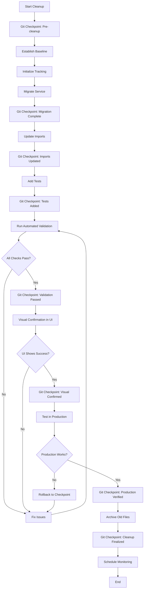

# Service Cleanup Validation Workflow

## Overview

This document defines the complete workflow for validating that service cleanup is actually complete and working, not just assumed to be done.

## The Problem

Without concrete validation, we can't truly know if:
- Services are working after migration
- Tests are actually passing
- Visual indicators show the correct status
- The cleanup improved or broke functionality

## The Solution: Multi-Stage Validation

### Stage 1: Pre-Cleanup Baseline
Before starting cleanup, establish baseline metrics:
```bash
# Capture current state
./service-cleanup-tracker.ts baseline <service-name>
```
- Current test pass rate
- Performance metrics
- Error rates
- Usage patterns

### Stage 2: Cleanup Execution
Follow the standard cleanup checklist:
```bash
# Initialize tracking
./service-cleanup-tracker.ts init <service-name>

# Execute cleanup tasks...
# Update status as you go
./service-cleanup-tracker.ts update <service-name> "task" --status completed
```

### Stage 3: Automated Validation
Run comprehensive validation checks:
```bash
# Validate the service works
./validate-service-cleanup.ts <service-name>
```

This performs:
1. **Compilation Check** - TypeScript compiles without errors
2. **Import Validation** - All imports use new paths
3. **Unit Tests** - Service-specific tests pass
4. **Integration Tests** - Tests in dhg-service-test pass
5. **Runtime Validation** - Service actually works when used

### Stage 4: Visual Confirmation
Open dhg-service-test UI and verify:
1. Navigate to http://localhost:5180
2. Go to the service's test page
3. Click "Run All Tests"
4. Verify all tests show green ✅
5. Check performance metrics are acceptable
6. Save test results to database

### Stage 5: Production Validation
Test in actual app usage:
```bash
# Run a sample operation that uses the service
./test-in-production.ts <service-name>
```

### Stage 6: Sign-off
Mark cleanup as validated:
```bash
# Record validation completion
./service-cleanup-tracker.ts validate <service-name> --confirmed
```

## Integration with Continuous Monitoring

### Automated Daily Checks
```yaml
schedule:
  validation_checks:
    cron: "0 10 * * *"  # 10 AM daily
    services:
      - SupabaseClientService
      - LoggerService
      - claudeService
```

### Health Dashboard
The dhg-admin-code app displays:
- Current validation status
- Last test run results
- Visual confirmation status
- Performance trends
- Error rates

### Alert Triggers
Automated alerts when:
- Validation fails after passing
- Performance degrades >20%
- Error rate increases
- Visual confirmation missing >24 hours

## The Complete Workflow with Git Checkpoints



## Key Commands

### Git Checkpoint Management
```bash
# Create checkpoint at current stage
./service-cleanup-git-integration.ts checkpoint <service> <stage>

# Example checkpoints during cleanup
./service-cleanup-git-integration.ts checkpoint LoggerService pre-cleanup
./service-cleanup-git-integration.ts checkpoint LoggerService migration-complete
./service-cleanup-git-integration.ts checkpoint LoggerService imports-updated

# List all checkpoints for a service
./service-cleanup-git-integration.ts list LoggerService

# Rollback to specific checkpoint
./service-cleanup-git-integration.ts rollback LoggerService pre-cleanup

# Compare progress across worktrees
./service-cleanup-git-integration.ts compare
```

### Service Cleanup Workflow
```bash
# Start dhg-service-test
cd apps/dhg-service-test && npm run dev

# Initialize cleanup tracking
./service-cleanup-tracker.ts init SupabaseClientService

# Run validation
./validate-service-cleanup.ts SupabaseClientService

# Check status
./service-cleanup-tracker.ts status SupabaseClientService

# View in browser
open http://localhost:5180

# Generate report
./service-cleanup-tracker.ts report
```

## Success Criteria

A service cleanup is ONLY considered complete when:

1. ✅ All automated validation checks pass
2. ✅ Visual confirmation in dhg-service-test UI
3. ✅ Production usage verified
4. ✅ Performance metrics acceptable
5. ✅ Zero regression in functionality
6. ✅ Documentation updated
7. ✅ Monitoring configured

## Continuous Improvement

After each cleanup:
1. Review what worked/didn't work
2. Update validation scripts
3. Improve test coverage
4. Enhance visual indicators
5. Document lessons learned

This ensures each service cleanup is better than the last.