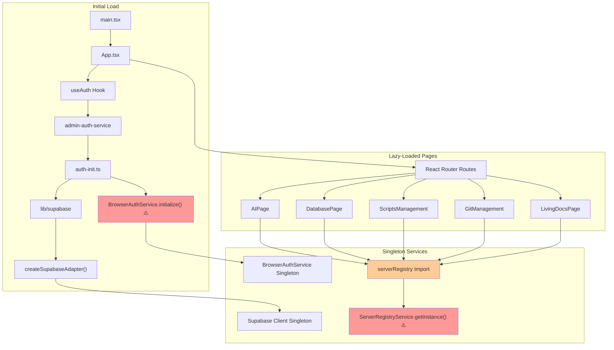

# dhg-admin-code Startup Analysis & Import Tree

## Startup Flow Visualization



## Key Initialization Points

### 1. Module-Level Initializations (Executed on Import)

| Service | Location | Initialization | Impact |
|---------|----------|----------------|---------|
| **BrowserAuthService** | `lib/auth-init.ts` | `BrowserAuthService.initialize(supabase)` | Runs before any component renders |
| **Supabase Client** | `lib/supabase.ts` | `createSupabaseAdapter({ env: import.meta.env })` | Creates singleton on first import |
| **serverRegistry** | Multiple pages | `ServerRegistryService.getInstance()` | Created when ANY page imports it |

### 2. Class-Only Exports (No Auto-Init)

- `ClipboardService`
- `CLIRegistryService`
- `ElementCatalogService`
- `ElementCriteriaService`
- `DevTaskService`

## Performance Impact Analysis

### Early Initialization Issues

1. **Authentication Service**
   - Initializes before user interaction
   - May cause unnecessary API calls on app load
   - Blocks rendering if initialization is slow

2. **Server Registry**
   - Multiple pages import it (5 identified)
   - Each import triggers `getInstance()`
   - Even if user never visits those pages

3. **Supabase Connection**
   - Established immediately on app load
   - Good for auth, but may be premature for other features

## Optimization Recommendations

### 1. Lazy Initialize serverRegistry

```typescript
// Instead of:
export const serverRegistry = ServerRegistryService.getInstance();

// Use:
let _serverRegistry: ServerRegistryService | null = null;
export const getServerRegistry = () => {
  if (!_serverRegistry) {
    _serverRegistry = ServerRegistryService.getInstance();
  }
  return _serverRegistry;
};
```

### 2. Defer Non-Critical Initializations

```typescript
// Move initialization to component mount
useEffect(() => {
  // Initialize service only when needed
  const registry = ServerRegistryService.getInstance();
  // ...
}, []);
```

### 3. Code-Split Heavy Services

```typescript
// Lazy load services with pages
const ServerRegistryService = lazy(() => 
  import('@shared/services/server-registry-service')
);
```

## Memory Footprint

### Services Always in Memory

1. **BrowserAuthService** - Required for auth state
2. **Supabase Client** - Needed for all DB operations
3. **serverRegistry** - Loaded by multiple pages

### Potential Memory Leaks

- Singleton services never get garbage collected
- Event listeners in services may accumulate
- WebSocket connections in serverRegistry persist

## Startup Timeline

```
1. main.tsx loads
2. App.tsx imports trigger
3. useAuth imports admin-auth-service
4. auth-init.ts runs BrowserAuthService.initialize()
5. Supabase client created
6. React Router renders
7. Current route component loads
8. If page uses serverRegistry, it initializes
9. Page-specific services load
```

## Recommendations

1. **Defer serverRegistry initialization** to first actual use
2. **Lazy-load page components** that use heavy services
3. **Profile startup time** to identify bottlenecks
4. **Consider service lifecycle management** for cleanup
5. **Implement initialization flags** to prevent double-init

## Testing Initialization Order

```typescript
// Add to services for debugging
console.log('[ServiceName] Initializing at', new Date().toISOString());
```

This will help identify the exact order and timing of service initializations.