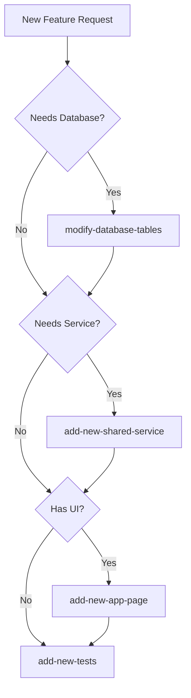
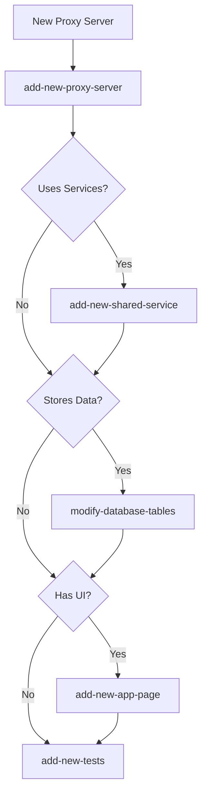

# Continuous Improvement Scenario: Service Dependency Check

## Scenario Overview
A meta-scenario that analyzes what you're trying to do and determines if other scenarios should be run first or in parallel. This helps ensure all dependencies are met and prevents incomplete implementations.

## Prerequisites
- Understanding of the project's architecture
- Knowledge of scenario relationships
- Ability to identify dependencies

## Steps

### 1. Analyze the Request
```bash
# Use the dependency checker
./scripts/cli-pipeline/continuous/continuous-cli.sh check-dependencies \
  --action "what you want to do" \
  --target "component/service/feature"
```

### 2. Dependency Analysis Matrix

| If You Want To... | You Might Need... | Check For... |
|-------------------|-------------------|--------------|
| Add a proxy server | - Shared service<br>- Database tables<br>- UI page | - Does it need new services?<br>- Does it store data?<br>- Does it have a UI? |
| Create a shared service | - Database tables<br>- Tests<br>- Migration | - Data persistence needs<br>- Cross-env compatibility<br>- Test requirements |
| Add an app page | - Database tables<br>- Shared service<br>- API endpoints | - Data source<br>- Business logic location<br>- Backend requirements |
| Modify database | - Migration<br>- Type updates<br>- Service updates | - Dependent services<br>- UI components<br>- Breaking changes |
| Add new tests | - Test infrastructure<br>- Mock data<br>- Test database | - Test environment<br>- Mock requirements<br>- CI integration |

### 3. Common Dependency Patterns

#### Pattern 1: New Feature Flow


#### Pattern 2: Proxy Server Dependencies


### 4. Dependency Check Script
```typescript
// scripts/cli-pipeline/continuous/utilities/scenario-dependencies.ts
interface ScenarioDependency {
  scenario: string;
  dependsOn: string[];
  optionalDependencies: string[];
  triggers: string[];
}

const SCENARIO_DEPENDENCIES: ScenarioDependency[] = [
  {
    scenario: 'add-new-proxy-server',
    dependsOn: [],
    optionalDependencies: [
      'add-new-shared-service',
      'modify-database-tables'
    ],
    triggers: ['add-new-tests']
  },
  {
    scenario: 'add-new-app-page',
    dependsOn: [],
    optionalDependencies: [
      'modify-database-tables',
      'add-new-shared-service'
    ],
    triggers: ['add-new-tests']
  },
  {
    scenario: 'add-new-shared-service',
    dependsOn: [],
    optionalDependencies: ['modify-database-tables'],
    triggers: ['add-new-tests']
  },
  {
    scenario: 'modify-database-tables',
    dependsOn: [],
    optionalDependencies: [],
    triggers: [
      'update-types',
      'update-services',
      'add-new-tests'
    ]
  }
];

export function checkDependencies(scenario: string): {
  required: string[],
  optional: string[],
  willTrigger: string[]
} {
  const dep = SCENARIO_DEPENDENCIES.find(d => d.scenario === scenario);
  if (!dep) {
    return { required: [], optional: [], willTrigger: [] };
  }
  
  return {
    required: dep.dependsOn,
    optional: dep.optionalDependencies,
    willTrigger: dep.triggers
  };
}
```

### 5. Interactive Dependency Checker
```bash
# Check what's needed for your task
./scripts/cli-pipeline/continuous/continuous-cli.sh suggest

# Interactive prompts:
# What are you trying to do?
# > Add a new admin interface for managing users
# 
# Analyzing dependencies...
# 
# Recommended scenarios to run:
# 1. modify-database-tables (if new user fields needed)
# 2. add-new-shared-service (UserManagementService)
# 3. add-new-app-page (in dhg-admin-suite)
# 4. add-new-tests (for all new components)
# 
# Run all scenarios? (y/n)
```

### 6. Dependency Questions to Ask

#### For New Features:
- **Data Storage**: Will this feature store or retrieve data?
- **Business Logic**: Is there reusable logic that multiple components need?
- **User Interface**: Will users interact with this feature?
- **External APIs**: Does this integrate with external services?
- **Authentication**: Does this require user permissions?
- **Real-time Updates**: Does this need websocket/subscription support?

#### For Modifications:
- **Breaking Changes**: Will this break existing functionality?
- **Migration Needs**: Do we need to migrate existing data?
- **Service Updates**: Which services depend on this?
- **UI Updates**: Which UI components need updating?
- **Test Updates**: Which tests need updating?

### 7. Dependency Resolution Order

1. **Database First**
   - Tables must exist before services can use them
   - Migrations must run before types can be generated

2. **Services Second**
   - Services depend on database schema
   - Services must exist before UI can use them

3. **UI Third**
   - UI depends on services and data
   - UI components need typed interfaces

4. **Tests Last**
   - Tests need all components to exist
   - Tests verify the complete implementation

### 8. Parallel vs Sequential Execution

#### Can Run in Parallel:
- Multiple service creations (if independent)
- UI pages for different features
- Tests for different components
- Documentation updates

#### Must Run Sequentially:
- Database → Service → UI → Tests
- Migration → Type Generation → Code Updates
- Service Creation → Service Integration
- Breaking Change → Migration → Updates

### 9. Automated Dependency Resolution
```typescript
// Auto-resolve and suggest scenario order
export async function suggestScenarioOrder(
  description: string
): Promise<string[]> {
  const keywords = description.toLowerCase();
  const scenarios: string[] = [];
  
  // Check for database needs
  if (keywords.includes('store') || 
      keywords.includes('save') || 
      keywords.includes('database')) {
    scenarios.push('modify-database-tables');
  }
  
  // Check for service needs
  if (keywords.includes('service') || 
      keywords.includes('logic') || 
      keywords.includes('process')) {
    scenarios.push('add-new-shared-service');
  }
  
  // Check for UI needs
  if (keywords.includes('page') || 
      keywords.includes('ui') || 
      keywords.includes('interface')) {
    scenarios.push('add-new-app-page');
  }
  
  // Always add tests
  scenarios.push('add-new-tests');
  
  return scenarios;
}
```

### 10. Dependency Validation
```bash
# Validate all dependencies are met
./scripts/cli-pipeline/continuous/continuous-cli.sh validate-dependencies \
  --feature "my-new-feature"

# Output:
# ✅ Database tables exist
# ✅ Required services available
# ✅ UI components ready
# ⚠️ Missing tests for UserService
# ❌ Migration not applied
# 
# Run missing steps? (y/n)
```

## Dependency Check Checklist
- [ ] Identified all data storage needs
- [ ] Determined service requirements
- [ ] Checked for UI components
- [ ] Listed external integrations
- [ ] Identified breaking changes
- [ ] Ordered scenarios correctly
- [ ] Checked for parallel opportunities
- [ ] Validated existing dependencies
- [ ] Created execution plan
- [ ] Documented decisions

## Common Dependency Chains

### Admin Feature Chain
1. `modify-database-tables` → Create admin tables
2. `add-new-shared-service` → Create AdminService
3. `add-new-app-page` → Add to dhg-admin-suite
4. `add-new-tests` → Test all components

### API Integration Chain
1. `add-new-shared-service` → Create API client
2. `add-new-proxy-server` → Create proxy endpoint
3. `modify-database-tables` → Store API data
4. `add-new-tests` → Test integration

### Data Pipeline Chain
1. `modify-database-tables` → Create pipeline tables
2. `add-new-shared-service` → Create processor
3. `add-new-cli-command` → Create CLI interface
4. `add-new-tests` → Test pipeline

## Automation Script
```bash
# Run the dependency checker
./scripts/cli-pipeline/continuous/continuous-cli.sh check-dependencies \
  --description "I want to add user management to the admin panel"

# Get scenario suggestions
./scripts/cli-pipeline/continuous/continuous-cli.sh suggest \
  --interactive

# Validate dependencies for a feature
./scripts/cli-pipeline/continuous/continuous-cli.sh validate-dependencies \
  --feature "user-management"
```

## Success Criteria
- [ ] All dependencies identified
- [ ] Correct execution order determined
- [ ] No circular dependencies
- [ ] Parallel opportunities found
- [ ] Clear execution plan
- [ ] All scenarios documented
- [ ] Validation passing
- [ ] Ready to execute

## Related Scenarios
- ALL scenarios can be dependencies
- This scenario helps orchestrate them
- Use before starting any complex task
- Re-run if requirements change