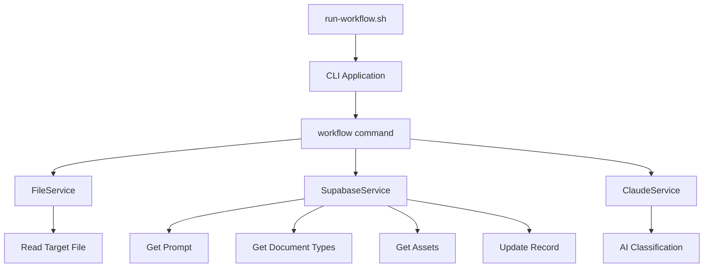

# CLI Workflow Pipeline Documentation

## Overview

The CLI Workflow Pipeline is a powerful system for processing markdown documents through AI-driven classification and analysis. It combines multiple services to extract insights from documentation and store them in a structured database format. This pipeline is designed for extensibility, allowing new "recipe" workflows to be built on the same foundation.

Currently, the primary workflow (`cli:workflow:execute`) analyzes markdown files, classifies them according to predefined document types, and updates the corresponding records in the `documentation_files` table.

## Quick Start

To run the default workflow:

```bash
# From the project root
pnpm run cli:workflow:execute

# Or directly
./scripts/run-workflow.sh --execute
```

This will:
1. Analyze the default markdown file (docs/markdown-report.md or README.md as fallback)
2. Call the Claude API to classify the document
3. Update the corresponding record in the `documentation_files` table

## How It Works

### Pipeline Components

The workflow consists of these main components:

1. **Shell Script** (`run-workflow.sh`): Entry point that sets up the environment and executes the CLI
2. **CLI Application** (`scripts/cli`): TypeScript application with modular services
3. **Services**: Reusable modules for different responsibilities:
   - `SupabaseService`: Database interactions
   - `ClaudeService`: AI API communication
   - `FileService`: File system operations
4. **Commands**: Action implementations that coordinate services
   - `workflow`: Main command for document classification



### Execution Flow

1. The shell script (`run-workflow.sh`) identifies environment variables and the target file
2. The CLI loads required services
3. `FileService` reads the target markdown file
4. `SupabaseService` retrieves the classification prompt, document types, and related assets
5. `ClaudeService` calls the Claude API with all context for document analysis
6. `SupabaseService` updates the corresponding record in the `documentation_files` table

## Creating New Recipe Pipelines

To create a new recipe pipeline without modifying the existing one:

### 1. Create a New Shell Script

```bash
#!/bin/bash
# scripts/run-custom-workflow.sh

# Copy the structure from run-workflow.sh
# Modify the TARGET_FILE logic to use a parameter

TARGET_FILE="$1"  # Accept file path as first parameter

if [ -z "$TARGET_FILE" ]; then
  echo "Error: No target file specified"
  echo "Usage: ./scripts/run-custom-workflow.sh <file-path>"
  exit 1
fi

# Continue with the rest of the script...
```

### 2. Add a New Command in the CLI

Create a new command file in `scripts/cli/src/commands/custom-workflow.ts` based on the existing workflow command, then register it in `index.ts`.

### 3. Create a New Package Script

Add to package.json:

```json
"scripts": {
  "cli:custom-workflow": "scripts/run-custom-workflow.sh",
  "cli:custom-workflow:execute": "scripts/run-custom-workflow.sh --execute"
}
```

## Parameterizing the Existing Script

To parameterize the current workflow to accept a target file:

1. **Modify run-workflow.sh**:

```bash
#!/bin/bash

# Get the target file from the first parameter, or use default
if [ -n "$1" ] && [ "$1" != "--execute" ]; then
  TARGET_FILE="$1"
else
  TARGET_FILE="$(pwd)/docs/markdown-report.md"
  # Use fallback if needed
  if [ ! -f "$TARGET_FILE" ]; then
    TARGET_FILE="$(pwd)/README.md"
  fi
fi

# Check for execute flag in any position
if [[ "$*" == *"--execute"* ]]; then
  EXECUTE_FLAG="--execute"
else
  EXECUTE_FLAG=""
fi

# Later in the script:
node "${CLI_DIR}/dist/index.js" workflow "${TARGET_FILE}" --verbose ${EXECUTE_FLAG}
```

2. **Update package.json**:

```json
"scripts": {
  "cli:workflow": "scripts/run-workflow.sh",
  "cli:workflow:execute": "scripts/run-workflow.sh --execute",
  "cli:workflow:file": "scripts/run-workflow.sh",
  "cli:workflow:file:execute": "scripts/run-workflow.sh --execute"
}
```

3. **Usage**:

```bash
# Process a specific file
pnpm run cli:workflow:file path/to/file.md

# Process a specific file and execute the API call
pnpm run cli:workflow:file:execute path/to/file.md
```

## Reusable Components

Each service in the CLI is designed for reuse in other recipe pipelines:

### SupabaseService

Handles all database interactions:

```typescript
// Key methods:
- getPromptByName(name: string): Gets prompt content by name
- getRelationshipsByPromptId(promptId: string): Gets related assets
- getDocumentTypesByCategory(category: string): Gets document types
- getDocumentationFileByPath(filePath: string): Finds a file in database
- updateDocumentationFileAssessment(docFileId, assessment, documentTypeId?): Updates a record
```

### ClaudeService

Handles AI API communication:

```typescript
// Key methods:
- callClaudeApi(request: ClaudeRequest): Generic API call
- classifyDocument(document, prompt, context): Document classification
```

### FileService

Handles file system operations:

```typescript
// Key methods:
- readFile(filePath: string): Reads with error handling
- writeFile(filePath: string, content: string): Writes with error handling
```

## Response Format

The Claude API response follows a structured format that maps directly to database fields:

```json
{
  "document_type_id": "uuid-from-document-types",
  "document_type": "Name of document type",
  "title": "Document title",
  "summary": "Document summary",
  "ai_generated_tags": ["tag1", "tag2", "tag3"],
  "assessment_quality_score": 0.85,
  "classification_reasoning": "Why this document type was chosen",
  "quality_assessment": {
    "completeness": 4,
    "clarity": 4,
    "accuracy": 4,
    "overall": 4
  }
}
```

## Best Practices

1. **Keep services independent** to promote reuse
2. **Create dedicated commands** for each workflow type
3. **Use shell scripts as entry points** to set up the environment
4. **Parameterize inputs** to increase flexibility
5. **Direct field mapping** between API responses and database tables
6. **Comprehensive error handling** at each step
7. **Detailed logging** for debugging and transparency

## Troubleshooting

- **Environment Variables**: Ensure all required variables are present in `.env.development`
- **File Paths**: Use absolute paths or ensure consistent working directory
- **Database Records**: Verify the target file exists in the `documentation_files` table
- **Error Logs**: Check for detailed error messages in the CLI output

---

**Request Information:**
This document was created in response to a request for documentation on the CLI workflow pipeline, explaining how it works, how to extend it with new recipes, and how to parameterize the existing script to accept a target file parameter.