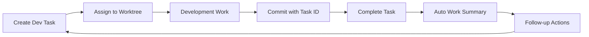

# DHG Super Agent Development System
**Living Document - Last Updated: 2025-06-11**

## Metadata
- **Status**: Active
- **Priority**: Critical
- **Category**: Core System Architecture
- **Review Cycle**: Weekly
- **Next Review**: 2025-06-18
- **Tags**: super-agent, development-system, architecture, dhg-god

## Overview

This document describes the comprehensive AI-driven development system that powers the DHG monorepo. It represents the convergence of multiple subsystems into a unified, continuously improving development environment. This system enables multi-agent Claude Code instances to work harmoniously on complex tasks while maintaining code quality, documentation freshness, and knowledge preservation.

## System Architecture

### Core Components

1. **Shared Services** (`packages/shared/services/`)
   - Singleton patterns for cross-environment compatibility
   - Core functionality shared by apps and scripts
   - Examples: SupabaseClientService, claudeService, deploymentService, documentArchivingService
   - 84+ services discovered through automated analysis

2. **CLI Pipelines** (`scripts/cli-pipeline/`)
   - Command-line interfaces that orchestrate services
   - 14+ active pipelines with command tracking
   - Registered in database for usage analytics
   - Examples: dev_tasks, work_summaries, document_archiving, deployment

3. **Background Servers**
   - Express servers providing functionality browsers cannot
   - Dynamically allocated ports via sys_server_ports_registry
   - Health monitoring and automatic discovery
   - Examples: git-server, deployment-server, living-docs-server

4. **Applications** (`apps/`)
   - User-facing interfaces leveraging all system components
   - 10+ apps including admin dashboards and specialized tools
   - Examples: dhg-admin-code, dhg-hub, dhg-audio, dhg-god (planned)

5. **Living Documentation** (`docs/living-docs/`)
   - Dynamic documents with review cycles
   - Database-tracked freshness and relevance
   - Automatic archiving of outdated content
   - Templates ensuring consistency

6. **Supabase Backend**
   - Central database for all system data
   - RLS policies for security
   - Real-time capabilities
   - Single source of truth via types.ts

## Development Lifecycle

### 1. Task Creation & Management



**Dev Tasks System**:
- Structured workflow: `pending → in_progress → testing → verified → completed → merged`
- Git integration for branch and commit tracking
- Worktree support for parallel development
- Success criteria and verification steps
- Claude-friendly request formatting

**Key Commands**:
```bash
./dev-tasks-cli.sh create --title "Feature X" --type feature --priority high
./dev-tasks-cli.sh submit <task-id> --text "task content"  # Recovery system
./dev-tasks-cli.sh commit  # Links commits to tasks
```

### 2. Work Execution & Tracking

**Work Summaries**:
- Automatic generation from completed dev tasks
- Manual creation for ad-hoc work
- Full-text searchable history
- Categorized: feature, bug_fix, refactoring, documentation

**Key Commands**:
```bash
./work-summaries-cli.sh add --title "Title" --content "Content" --category "feature" --tags "tag1,tag2"
```

### 3. Quality Assurance

**Testing Strategy**:
- Testing pyramid: 40% unit, 30% component, 20% integration, 10% E2E
- Vitest + React Testing Library + Playwright
- Phased rollout starting with critical paths
- Coverage goals increasing over time

**Service Dependencies**:
- Automatic discovery and mapping
- Safe refactoring through impact analysis
- Consolidation opportunity identification
- Archiving validation

### 4. Documentation Management

**Living Documents**:
- Review cycles (7-30 days based on priority)
- Automatic staleness detection
- Archive system preserving history
- Template-driven consistency

**Document Archiving**:
```bash
./document-archiving-cli.sh archive --path "old-doc.md" --reason "Superseded"
./document-archiving-cli.sh list --type living_doc
```

### 5. Deployment & Operations

**Deployment System**:
- Pre-deployment validations (TypeScript, dependencies, environment)
- Staging and production environments
- Rollback capabilities
- Health monitoring
- Full audit trail

**Server Management**:
- Dynamic port allocation
- Health check endpoints
- Service discovery for frontends

## Multi-Agent Collaboration

### Claude Code Integration

The system is designed for multiple Claude Code agents working in parallel:

1. **Worktree Isolation**: Each agent works in its own worktree
2. **Task Ownership**: Clear assignment prevents conflicts
3. **Knowledge Sharing**: Work summaries capture learnings
4. **Conflict Resolution**: Git merge strategies handle concurrent work

### DHG-God Application (Planned)

Central control application for orchestrating multi-agent work:
- Task distribution and prioritization
- Agent performance monitoring
- System health dashboards
- Resource allocation
- Conflict detection and resolution

## Continuous Improvement Cycle

### Feedback Loops

1. **Task Completion → Work Summary**: Knowledge capture
2. **Work Summary → Documentation Update**: Freshness triggers
3. **Documentation → Task Creation**: Gaps spawn new work
4. **Testing → Quality Metrics**: Coverage improvements
5. **Dependencies → Refactoring**: Consolidation opportunities

### Automation Progression

**Current State**:
- Manual task creation with AI assistance
- Semi-automated documentation reviews
- CLI-driven operations

**Future State**:
- AI-driven task generation from system analysis
- Fully automated documentation updates
- Self-healing systems
- Predictive maintenance

## Best Practices

### Task Management
- Always include clear success criteria
- Link commits to tasks via IDs
- Complete tasks to generate summaries
- Use recovery system for timeout protection

### Documentation
- Follow living document templates
- Set appropriate review cycles
- Archive rather than delete
- Keep metadata current

### Code Organization
- Shared services for reusable functionality
- CLI pipelines for command-line tools
- Proper file locations (never root directory)
- Singleton patterns for services

### Git Workflow
- Direct push to development (no PRs in worktrees)
- Task IDs in commit messages
- Regular synchronization with development
- Clean worktree management

## System Benefits

1. **Searchable History**: All work documented and findable
2. **Context Preservation**: Nothing valuable lost
3. **Quality Enforcement**: Automated checks and gates
4. **Developer Confidence**: Clear workflows and safety nets
5. **Knowledge Accumulation**: Each task builds understanding
6. **Parallel Development**: Multiple features progress simultaneously
7. **Self-Documenting**: System tracks its own evolution

## Implementation Roadmap

### Phase 1: Foundation (Complete)
- ✅ Dev tasks system
- ✅ Work summaries
- ✅ Basic CLI pipelines
- ✅ Shared services architecture

### Phase 2: Enhancement (In Progress)
- ✅ Service dependency mapping
- ✅ Document archiving system
- ✅ Deployment management
- 🔄 Testing framework rollout
- 🔄 Living documentation system

### Phase 3: Intelligence (Upcoming)
- ⏳ DHG-God orchestration app
- ⏳ AI-driven task generation
- ⏳ Predictive system maintenance
- ⏳ Multi-agent coordination
- ⏳ Self-optimizing workflows

### Phase 4: Autonomy (Future)
- ⏳ Self-healing systems
- ⏳ Automatic refactoring
- ⏳ Intelligent documentation updates
- ⏳ Performance optimization
- ⏳ Resource management

## Success Metrics

- **Task Completion Rate**: > 90%
- **Documentation Freshness**: > 80% reviewed monthly
- **Test Coverage**: Increasing by phase (20% → 80%)
- **Service Consolidation**: Reducing duplication
- **Knowledge Retention**: 100% work summarized
- **System Uptime**: > 99.9%

## Maintenance Guidelines

### Daily
- Review active dev tasks
- Check deployment status
- Monitor server health

### Weekly
- Review living documents
- Analyze work summaries
- Update task priorities
- Archive obsolete documents

### Monthly
- Service dependency analysis
- Performance review
- System optimization
- Roadmap updates

## Troubleshooting

### Common Issues

1. **Task Timeout**: Use recovery system
2. **Merge Conflicts**: Follow pnpm-lock.yaml guidelines
3. **Service Discovery**: Check sys_server_ports_registry
4. **Documentation Staleness**: Run review cycles

### Support Resources

- CLAUDE.md for development guidelines
- Work summaries for solution history
- Living docs for current practices
- Archived docs for historical context

## Future Vision

The DHG Super Agent Development System will evolve into a fully autonomous development environment where:

1. AI agents collaborate seamlessly
2. Documentation self-updates
3. Code self-optimizes
4. Quality self-improves
5. Knowledge self-organizes

This system represents the future of AI-assisted software development, where human creativity is amplified by intelligent automation, creating a continuously improving codebase that learns from every interaction.

## Related Documents

### Active Living Docs
- dev-tasks-system.md
- continuous-monitoring-implementation-guide.md
- service-dependency-system.md
- deployment-management-system.md

### Superseded Documents
This document consolidates and supersedes:
- dev-tasks-lifecycle-management-guide.md
- documentation-management-system.md
- continuous-documentation-monitoring-vision.md
- testing-vision-and-implementation-guide.md
- worktree-assignment-system.md

---

*This living document represents the authoritative guide to the DHG development system. It will be updated weekly to reflect system evolution and learnings.*