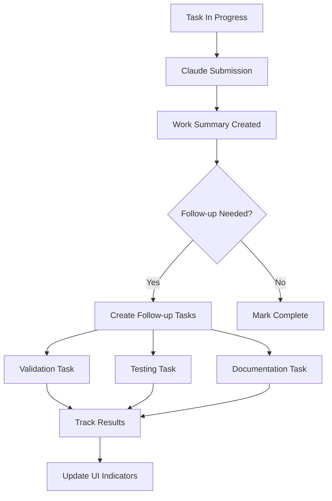

# Dev Task Lifecycle Tracking Specification V2
*Updated: June 11, 2025*
*Previous Version: June 11, 2025*

## Changes in V2
- Added comprehensive work summary tracking UI integration
- Enhanced submission tracking with Claude Code integration
- Added validation, testing, and documentation submission tracking
- Incorporated visual status indicators and progress tracking
- Added follow-up task management and action indicators

## 1. Overview

This specification defines a comprehensive system for tracking the complete lifecycle of development tasks from creation through completion, with enhanced work summary visualization and tracking capabilities.

### 1.1 Core Objectives
- Track task progress through defined lifecycle states
- Monitor Claude Code submission activities and results
- Visualize work summaries with comprehensive tracking information
- Link commits, work summaries, validations, and test results
- Provide actionable insights through visual indicators
- Enable follow-up task management and progress tracking

### 1.2 Key Components
1. **Task State Management**: Lifecycle states with transitions
2. **Work Summary Tracking**: Enhanced UI with comprehensive visualization
3. **Submission Tracking**: Claude Code submissions with timestamps and worktree info
4. **Validation & Testing**: Track follow-up task submissions and results
5. **Progress Monitoring**: Visual indicators and checklists
6. **Action Management**: Identify tasks needing follow-up

## 2. Database Schema Enhancements

### 2.1 Core Tables

```sql
-- Enhanced dev_tasks table
ALTER TABLE dev_tasks 
ADD COLUMN work_summary_count INTEGER DEFAULT 0,
ADD COLUMN last_work_summary_at TIMESTAMP WITH TIME ZONE,
ADD COLUMN validation_submission_id UUID,
ADD COLUMN test_submission_id UUID,
ADD COLUMN documentation_submission_id UUID;

-- Work summary tracking enhancements
ALTER TABLE ai_work_summaries 
ADD COLUMN dev_task_id UUID REFERENCES dev_tasks(id),
ADD COLUMN validation_status TEXT CHECK (validation_status IN ('pending', 'validated', 'failed', 'issues_found')),
ADD COLUMN has_tests BOOLEAN DEFAULT false,
ADD COLUMN test_results_id UUID;

-- New tables for comprehensive tracking
CREATE TABLE work_summary_validations (
  id UUID PRIMARY KEY DEFAULT gen_random_uuid(),
  work_summary_id UUID REFERENCES ai_work_summaries(id) ON DELETE CASCADE,
  dev_task_id UUID REFERENCES dev_tasks(id),
  validated_at TIMESTAMPTZ DEFAULT NOW(),
  validation_status TEXT NOT NULL CHECK (validation_status IN ('pending', 'passed', 'failed', 'issues_found')),
  validation_summary TEXT,
  issues JSONB DEFAULT '[]',
  validator_type TEXT DEFAULT 'manual',
  created_at TIMESTAMPTZ DEFAULT NOW(),
  updated_at TIMESTAMPTZ DEFAULT NOW()
);

CREATE TABLE test_results (
  id UUID PRIMARY KEY DEFAULT gen_random_uuid(),
  dev_task_id UUID REFERENCES dev_tasks(id),
  work_summary_id UUID REFERENCES ai_work_summaries(id),
  test_suite_name TEXT,
  passed_count INTEGER DEFAULT 0,
  failed_count INTEGER DEFAULT 0,
  skipped_count INTEGER DEFAULT 0,
  total_count INTEGER DEFAULT 0,
  coverage_percentage DECIMAL(5,2),
  execution_time_ms INTEGER,
  report_url TEXT,
  test_output JSONB,
  created_at TIMESTAMPTZ DEFAULT NOW()
);

-- Follow-up task tracking
CREATE TABLE dev_task_follow_ups (
  id UUID PRIMARY KEY DEFAULT gen_random_uuid(),
  parent_task_id UUID REFERENCES dev_tasks(id),
  follow_up_task_id UUID REFERENCES dev_tasks(id),
  follow_up_type TEXT CHECK (follow_up_type IN ('validation', 'testing', 'documentation', 'bug_fix', 'enhancement')),
  priority TEXT DEFAULT 'medium',
  follow_up_summary TEXT,
  created_at TIMESTAMPTZ DEFAULT NOW()
);

-- Work summary todo items
CREATE TABLE work_summary_todos (
  id UUID PRIMARY KEY DEFAULT gen_random_uuid(),
  work_summary_id UUID REFERENCES ai_work_summaries(id),
  todo_text TEXT NOT NULL,
  completed BOOLEAN DEFAULT false,
  priority TEXT DEFAULT 'medium',
  sequence_order INTEGER,
  created_at TIMESTAMPTZ DEFAULT NOW(),
  completed_at TIMESTAMPTZ
);
```

### 2.2 Comprehensive Tracking View

```sql
CREATE OR REPLACE VIEW work_summary_tracking_view AS
SELECT 
  ws.id,
  ws.title,
  ws.summary_content,
  ws.work_date,
  ws.category,
  ws.worktree,
  ws.created_at,
  
  -- Dev task info
  dt.id as dev_task_id,
  dt.title as dev_task_title,
  dt.status as dev_task_status,
  
  -- Submission info
  dt.claude_submission_timestamp as submission_timestamp,
  dt.claude_submission_worktree as submission_worktree,
  dt.git_commit_current as git_commit,
  dt.worktree as git_branch,
  
  -- Validation info
  wsv.validated_at,
  wsv.validation_status,
  wsv.validation_summary,
  jsonb_array_length(wsv.issues) as issue_count,
  
  -- Test results
  tr.passed_count,
  tr.failed_count,
  tr.coverage_percentage,
  tr.report_url as test_report_url,
  
  -- Todo progress
  COUNT(wst.id) as total_todos,
  COUNT(wst.id) FILTER (WHERE wst.completed = true) as completed_todos,
  
  -- Follow-up tasks
  COUNT(dtf.id) as follow_up_count,
  COUNT(dtf.id) FILTER (WHERE ft.status = 'completed') as completed_follow_ups,
  
  -- Computed fields
  CASE 
    WHEN dt.claude_submission_timestamp IS NOT NULL THEN true 
    ELSE false 
  END as has_submission,
  CASE 
    WHEN wsv.id IS NOT NULL THEN true 
    ELSE false 
  END as has_validation,
  CASE 
    WHEN tr.id IS NOT NULL THEN true 
    ELSE false 
  END as has_tests,
  CASE
    WHEN tr.failed_count > 0 THEN true
    WHEN wsv.validation_status = 'issues_found' THEN true
    WHEN COUNT(dtf.id) > COUNT(dtf.id) FILTER (WHERE ft.status = 'completed') THEN true
    ELSE false
  END as needs_action

FROM ai_work_summaries ws
LEFT JOIN dev_tasks dt ON ws.dev_task_id = dt.id
LEFT JOIN work_summary_validations wsv ON ws.id = wsv.work_summary_id
LEFT JOIN test_results tr ON ws.id = tr.work_summary_id
LEFT JOIN work_summary_todos wst ON ws.id = wst.work_summary_id
LEFT JOIN dev_task_follow_ups dtf ON dt.id = dtf.parent_task_id
LEFT JOIN dev_tasks ft ON dtf.follow_up_task_id = ft.id
GROUP BY ws.id, dt.id, wsv.id, tr.id;
```

## 3. UI Component Architecture

### 3.1 WorkSummaryCard Component

```typescript
interface WorkSummaryCardProps {
  summary: WorkSummary;
  devTask?: DevTaskInfo;
  submissionInfo?: SubmissionInfo;
  validationInfo?: ValidationInfo;
  testResults?: TestResults;
  todoItems?: TodoItem[];
  followUpTasks?: FollowUpTask[];
  onToggleTodo?: (todoId: string) => void;
  onCreateFollowUpTask?: () => void;
  expanded?: boolean;
  onToggleExpanded?: () => void;
}

// Visual structure:
// ┌─────────────────────────────────────────┐
// │ [Task Name] → Original Task             │
// │ ● ● ● ● Status Indicators               │
// ├─────────────────────────────────────────┤
// │ 📝 Summary Content                      │
// │ 🕒 Submitted: 6/11 10:30 on improve-cli │
// │ 🔗 Commit: abc123                       │
// ├─────────────────────────────────────────┤
// │ ✓ Validation: Passed                    │
// │ ✓ Tests: 45/50 passed (90%)            │
// │ ✓ Docs: Updated                         │
// ├─────────────────────────────────────────┤
// │ 📋 Follow-up Tasks (2/5)                │
// │ ☐ Fix failing tests                    │
// │ ☐ Update documentation                  │
// │ ✓ Review code coverage                  │
// ├─────────────────────────────────────────┤
// │ ⚠️ Action Required: 5 tests failing     │
// └─────────────────────────────────────────┘
```

### 3.2 Status Indicator System

```typescript
enum SubmissionStatus {
  NOT_SUBMITTED = 'not_submitted',
  SUBMITTED = 'submitted',
  IN_PROGRESS = 'in_progress',
  COMPLETED = 'completed'
}

interface StatusIndicator {
  submission: SubmissionStatus;
  validation: ValidationStatus;
  testing: TestStatus;
  documentation: DocStatus;
}

// Visual representation:
// ● Gray: Not started
// ● Yellow: In progress
// ● Green: Completed successfully
// ● Red: Failed/Issues found
// ● Orange: Action required
```

### 3.3 Progress Tracking Components

```typescript
interface ProgressTracker {
  totalSteps: number;
  completedSteps: number;
  currentStep: string;
  estimatedCompletion?: Date;
}

interface TodoChecklist {
  items: TodoItem[];
  progress: number; // 0-100 percentage
  onToggle: (itemId: string) => void;
  onAddItem?: (text: string) => void;
}
```

## 4. Lifecycle State Machine

### 4.1 Enhanced State Definitions

```typescript
enum TaskLifecycleState {
  // Creation phase
  CREATED = 'created',
  ASSIGNED = 'assigned',
  
  // Development phase
  IN_PROGRESS = 'in_progress',
  SUBMITTED = 'submitted',
  
  // Review phase
  IN_REVIEW = 'in_review',
  CHANGES_REQUESTED = 'changes_requested',
  
  // Validation phase
  VALIDATING = 'validating',
  VALIDATION_FAILED = 'validation_failed',
  
  // Testing phase
  TESTING = 'testing',
  TESTS_FAILED = 'tests_failed',
  
  // Documentation phase
  DOCUMENTING = 'documenting',
  
  // Completion phase
  COMPLETED = 'completed',
  CANCELLED = 'cancelled'
}
```

### 4.2 State Transition Rules

```typescript
const stateTransitions: Map<TaskLifecycleState, TaskLifecycleState[]> = new Map([
  [TaskLifecycleState.CREATED, [TaskLifecycleState.ASSIGNED, TaskLifecycleState.CANCELLED]],
  [TaskLifecycleState.ASSIGNED, [TaskLifecycleState.IN_PROGRESS, TaskLifecycleState.CANCELLED]],
  [TaskLifecycleState.IN_PROGRESS, [TaskLifecycleState.SUBMITTED, TaskLifecycleState.CANCELLED]],
  [TaskLifecycleState.SUBMITTED, [TaskLifecycleState.IN_REVIEW, TaskLifecycleState.IN_PROGRESS]],
  [TaskLifecycleState.IN_REVIEW, [TaskLifecycleState.VALIDATING, TaskLifecycleState.CHANGES_REQUESTED]],
  [TaskLifecycleState.CHANGES_REQUESTED, [TaskLifecycleState.IN_PROGRESS]],
  [TaskLifecycleState.VALIDATING, [TaskLifecycleState.TESTING, TaskLifecycleState.VALIDATION_FAILED]],
  [TaskLifecycleState.VALIDATION_FAILED, [TaskLifecycleState.IN_PROGRESS]],
  [TaskLifecycleState.TESTING, [TaskLifecycleState.DOCUMENTING, TaskLifecycleState.TESTS_FAILED]],
  [TaskLifecycleState.TESTS_FAILED, [TaskLifecycleState.IN_PROGRESS]],
  [TaskLifecycleState.DOCUMENTING, [TaskLifecycleState.COMPLETED]],
  [TaskLifecycleState.COMPLETED, []] // Terminal state
]);
```

## 5. Tracking Functions

### 5.1 Work Summary Creation with Task Linking

```sql
CREATE OR REPLACE FUNCTION create_work_summary_with_task_link(
  p_title TEXT,
  p_content TEXT,
  p_task_id UUID,
  p_worktree TEXT,
  p_git_commit TEXT
) RETURNS UUID AS $$
DECLARE
  v_summary_id UUID;
BEGIN
  -- Create work summary
  INSERT INTO ai_work_summaries (
    title,
    summary_content,
    dev_task_id,
    worktree,
    created_at
  ) VALUES (
    p_title,
    p_content,
    p_task_id,
    p_worktree,
    NOW()
  ) RETURNING id INTO v_summary_id;
  
  -- Update task tracking
  UPDATE dev_tasks 
  SET 
    work_summary_count = COALESCE(work_summary_count, 0) + 1,
    last_work_summary_at = NOW(),
    git_commit_current = p_git_commit
  WHERE id = p_task_id;
  
  -- Create initial todos if template exists
  INSERT INTO work_summary_todos (work_summary_id, todo_text, sequence_order)
  SELECT v_summary_id, todo_text, sequence_order
  FROM task_todo_templates
  WHERE task_type = (SELECT type FROM dev_tasks WHERE id = p_task_id);
  
  RETURN v_summary_id;
END;
$$ LANGUAGE plpgsql;
```

### 5.2 Follow-up Task Creation

```sql
CREATE OR REPLACE FUNCTION create_follow_up_task(
  p_parent_task_id UUID,
  p_title TEXT,
  p_type TEXT,
  p_priority TEXT DEFAULT 'medium'
) RETURNS UUID AS $$
DECLARE
  v_follow_up_id UUID;
BEGIN
  -- Create the follow-up task
  INSERT INTO dev_tasks (
    title,
    status,
    priority,
    type,
    parent_task_id,
    created_at
  ) VALUES (
    p_title,
    'created',
    p_priority,
    p_type,
    p_parent_task_id,
    NOW()
  ) RETURNING id INTO v_follow_up_id;
  
  -- Link to parent
  INSERT INTO dev_task_follow_ups (
    parent_task_id,
    follow_up_task_id,
    follow_up_type,
    priority
  ) VALUES (
    p_parent_task_id,
    v_follow_up_id,
    p_type,
    p_priority
  );
  
  RETURN v_follow_up_id;
END;
$$ LANGUAGE plpgsql;
```

## 6. CLI Integration

### 6.1 Enhanced Commands

```bash
# List tasks with work summary indicators
dev-tasks-cli.sh list --show-summaries

# Show task with full tracking info
dev-tasks-cli.sh show <task-id> --include-tracking

# Create work summary with task link
dev-tasks-cli.sh create-summary <task-id> --title "..." --content "..."

# Track validation submission
dev-tasks-cli.sh track-validation <task-id> --status passed --summary "..."

# Track test results
dev-tasks-cli.sh track-tests <task-id> --passed 45 --failed 5 --coverage 90

# Create follow-up task
dev-tasks-cli.sh create-follow-up <parent-id> --type validation --title "..."
```

### 6.2 Tracking Automation

```typescript
// Auto-detect task references in work summaries
function detectTaskReferences(content: string): string[] {
  const patterns = [
    /Task:\s*#([a-f0-9-]{36})/gi,  // Task: #uuid
    /dev[_-]task[_-]id:\s*([a-f0-9-]{36})/gi,  // dev_task_id: uuid
    /#(\d{8}[a-f0-9-]{28})/gi  // Short form #12345678-...
  ];
  
  const matches: string[] = [];
  patterns.forEach(pattern => {
    const found = content.matchAll(pattern);
    for (const match of found) {
      matches.push(match[1]);
    }
  });
  
  return [...new Set(matches)];
}
```

## 7. Visual Design Guidelines

### 7.1 Information Hierarchy

1. **Primary Information** (Always visible):
   - Task title with link
   - Status indicators (4 dots)
   - Summary excerpt

2. **Secondary Information** (Expandable):
   - Full submission details
   - Validation/test results
   - Todo checklist

3. **Tertiary Information** (On demand):
   - Full test output
   - Detailed logs
   - Historical changes

### 7.2 Color Coding System

```scss
// Status colors
$status-not-started: #6B7280;  // Gray
$status-in-progress: #F59E0B;  // Yellow
$status-success: #10B981;      // Green
$status-failed: #EF4444;       // Red
$status-warning: #F97316;      // Orange

// Priority colors
$priority-high: #DC2626;       // Red
$priority-medium: #F59E0B;     // Yellow
$priority-low: #10B981;        // Green
```

### 7.3 Progressive Disclosure

```typescript
interface DisclosureLevel {
  collapsed: {
    height: '80px',
    shows: ['title', 'status-dots', 'summary-line']
  },
  expanded: {
    height: 'auto',
    shows: ['all-primary', 'submission-info', 'results-summary']
  },
  detailed: {
    height: 'auto',
    shows: ['everything', 'logs', 'raw-data']
  }
}
```

## 8. Workflow Integration

### 8.1 Task Submission Flow



### 8.2 Automated Tracking Points

1. **On Work Summary Creation**: Link to active task
2. **On Git Commit**: Update task commit info
3. **On Validation Run**: Create validation record
4. **On Test Execution**: Store test results
5. **On Documentation Update**: Mark docs complete

## 9. Implementation Priority

### Phase 1 (Immediate)
- Database schema updates ✅
- Work summary card component ✅
- Basic tracking view ✅
- Task linking functionality ✅

### Phase 2 (Next Sprint)
- Follow-up task management
- Todo checklist functionality
- Validation/test tracking
- Status indicators

### Phase 3 (Future)
- Automated task detection
- Progress predictions
- Workflow automation
- Advanced analytics

## 10. Success Metrics

- **Visibility**: 100% of work summaries linked to tasks
- **Tracking**: All follow-up tasks tracked and visible
- **Completion**: 80%+ tasks with full lifecycle data
- **Actionability**: <24hr response to action items
- **User Satisfaction**: Reduced context switching

This enhanced specification provides a complete blueprint for implementing comprehensive work summary tracking that gives developers full visibility into their task lifecycle while maintaining a clean, actionable UI.