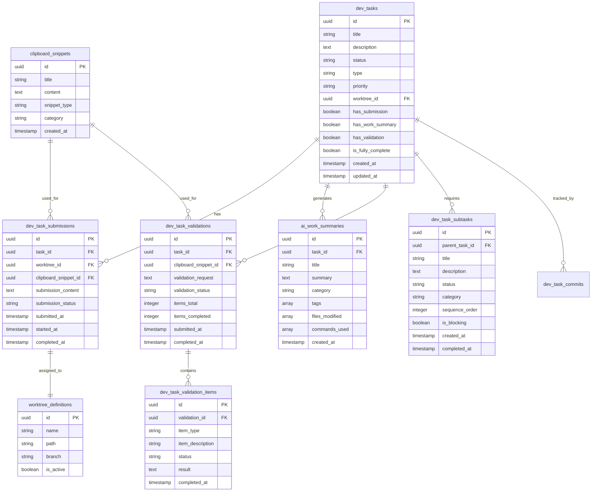
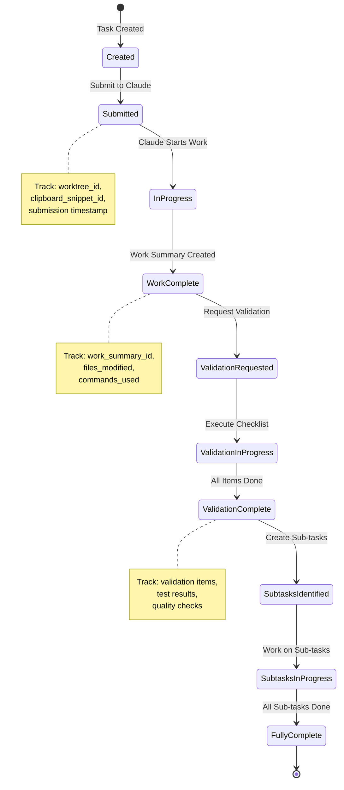

# Dev Task Lifecycle Tracking System - Technical Specification

## Executive Summary

This specification defines a comprehensive tracking system for development tasks through their complete lifecycle, from initial submission to full completion with all validation and follow-up tasks. The system provides visibility into task submission status, work summaries, validation steps, and sub-task tracking.

## Problem Statement

Currently, there is insufficient visibility into:
1. Whether a dev task has been submitted to Claude Code and on which worktree
2. What work summaries exist for completed tasks
3. Whether follow-up validation has been performed
4. What sub-tasks are required for true completion
5. The overall workflow state of each task

## System Architecture

### Database Schema



### Key Tables and Relationships

#### 1. **dev_tasks** (Enhanced)
New fields to add:
- `has_submission`: Boolean flag indicating if task has been submitted to Claude
- `has_work_summary`: Boolean flag indicating if work summary exists
- `has_validation`: Boolean flag indicating if validation has been performed
- `is_fully_complete`: Boolean flag indicating all sub-tasks are complete
- `worktree_id`: Direct reference to assigned worktree

#### 2. **dev_task_submissions** (New)
Tracks when and how tasks are submitted to Claude:
- Links task to worktree where work is performed
- References clipboard snippet used for submission
- Tracks submission lifecycle (submitted → in_progress → completed)
- Stores submission content for audit trail

#### 3. **dev_task_validations** (New)
Tracks validation and follow-up requests:
- Links to clipboard snippet used for validation
- Tracks validation status and progress
- Aggregates completion metrics

#### 4. **dev_task_validation_items** (New)
Individual validation checklist items:
- Database migrations
- Testing completion
- Documentation updates
- Service architecture review
- CLI integration
- Quality checks
- etc.

#### 5. **dev_task_subtasks** (New)
Granular tasks required for full completion:
- Hierarchical task breakdown
- Blocking vs non-blocking tasks
- Category-based organization (testing, docs, deployment, etc.)
- Sequence ordering for dependent tasks

## Workflow States



## UI Requirements

### Dev Tasks List View Enhancements

```typescript
interface DevTaskListItem {
  id: string;
  title: string;
  status: string;
  priority: string;
  
  // New tracking fields
  submission: {
    hasSubmission: boolean;
    worktreeName?: string;
    submittedAt?: Date;
    status?: 'submitted' | 'in_progress' | 'completed';
  };
  
  workSummary: {
    hasWorkSummary: boolean;
    summaryId?: string;
    createdAt?: Date;
    title?: string;
  };
  
  validation: {
    hasValidation: boolean;
    validationStatus?: 'requested' | 'in_progress' | 'completed';
    itemsCompleted?: number;
    itemsTotal?: number;
    completionPercentage?: number;
  };
  
  subtasks: {
    total: number;
    completed: number;
    blocking: number;
    categories: string[];
  };
  
  isFullyComplete: boolean;
}
```

### Visual Indicators

1. **Submission Status**
   - 📝 Not submitted (gray)
   - 🔄 Submitted, in progress (yellow)
   - ✅ Submitted, completed (green)

2. **Work Summary Status**
   - 📋 No work summary (gray)
   - ✅ Work summary exists (green)

3. **Validation Status**
   - ❓ Not validated (gray)
   - 🔍 Validation in progress (yellow)
   - ✅ Validation complete (green)

4. **Sub-task Progress**
   - Progress bar: [====----] 4/10 tasks
   - 🚫 Blocked by dependencies (red)

### Task Detail View

```
┌─────────────────────────────────────────────────────────────┐
│ Task: Implement Feature X                                    │
├─────────────────────────────────────────────────────────────┤
│ 📊 Lifecycle Status                                         │
│                                                             │
│ 1. Submission ✅                                            │
│    • Worktree: feature/feature-x                           │
│    • Submitted: 2025-06-11 10:00 AM                       │
│    • Clipboard: "Feature X Implementation Request"         │
│                                                             │
│ 2. Work Summary ✅                                          │
│    • Created: 2025-06-11 2:00 PM                          │
│    • Title: "Implemented Feature X with tests"            │
│    • Files: 12 modified, 3 created                        │
│                                                             │
│ 3. Validation 🔄 (7/10 complete)                           │
│    ✅ TypeScript compilation                               │
│    ✅ Unit tests created                                   │
│    ✅ Documentation updated                                │
│    ✅ No hardcoded credentials                            │
│    ✅ CLI commands registered                              │
│    ✅ Database migrations applied                          │
│    ✅ Success criteria defined                             │
│    ❌ Integration tests pending                            │
│    ❌ Performance benchmarks                               │
│    ❌ Deployment verification                              │
│                                                             │
│ 4. Sub-tasks (3/5 complete)                                │
│    ✅ Create monitoring dashboard                          │
│    ✅ Add error handling for edge cases                   │
│    ✅ Update API documentation                             │
│    🔄 Add feature flag support                            │
│    ❌ Create user onboarding guide                        │
└─────────────────────────────────────────────────────────────┘
```

## API Endpoints

### 1. Submit Task to Claude
```typescript
POST /api/dev-tasks/:taskId/submit
{
  worktreeId: string;
  clipboardSnippetId?: string;
  submissionContent: string;
}
```

### 2. Link Work Summary
```typescript
POST /api/dev-tasks/:taskId/work-summary
{
  workSummaryId: string;
}
```

### 3. Request Validation
```typescript
POST /api/dev-tasks/:taskId/validate
{
  clipboardSnippetId?: string;
  validationRequest: string;
}
```

### 4. Update Validation Item
```typescript
PUT /api/dev-tasks/:taskId/validation-items/:itemId
{
  status: 'pending' | 'in_progress' | 'completed' | 'failed';
  result?: string;
}
```

### 5. Create Sub-task
```typescript
POST /api/dev-tasks/:taskId/subtasks
{
  title: string;
  description: string;
  category: string;
  isBlocking: boolean;
  sequenceOrder?: number;
}
```

## CLI Integration

### New Commands

```bash
# Submit task to Claude
./dev-tasks-cli.sh submit <task-id> --worktree <worktree-name> [--clipboard <snippet-id>]

# Link work summary
./dev-tasks-cli.sh link-summary <task-id> <work-summary-id>

# Request validation
./dev-tasks-cli.sh validate <task-id> [--clipboard <snippet-id>]

# Update validation item
./dev-tasks-cli.sh validation-update <task-id> <item-id> --status completed

# Create sub-task
./dev-tasks-cli.sh add-subtask <task-id> --title "..." --category "..." [--blocking]

# View lifecycle status
./dev-tasks-cli.sh lifecycle <task-id>
```

## Automation Opportunities

### 1. Automatic Work Summary Linking
When a work summary is created with a task ID reference, automatically link it:
```sql
CREATE OR REPLACE FUNCTION link_work_summary_to_task()
RETURNS TRIGGER AS $$
BEGIN
  -- If summary mentions task ID, create link
  IF NEW.summary ~ '#[0-9a-f]{8}-[0-9a-f]{4}-[0-9a-f]{4}-[0-9a-f]{4}-[0-9a-f]{12}' THEN
    UPDATE dev_tasks 
    SET has_work_summary = true
    WHERE id = substring(NEW.summary from '#([0-9a-f]{8}-[0-9a-f]{4}-[0-9a-f]{4}-[0-9a-f]{4}-[0-9a-f]{12})')::uuid;
  END IF;
  RETURN NEW;
END;
$$ LANGUAGE plpgsql;
```

### 2. Validation Checklist Templates
Pre-defined validation checklists by task type:
```typescript
const validationTemplates = {
  feature: [
    'TypeScript compilation passes',
    'Unit tests created and passing',
    'Integration tests implemented',
    'Documentation updated',
    'Success criteria defined',
    'No hardcoded credentials',
    'CLI commands registered',
    'Database migrations applied',
    'Performance benchmarks met',
    'Deployment verified'
  ],
  bugfix: [
    'Root cause identified',
    'Fix implemented',
    'Regression tests added',
    'Related code reviewed',
    'Documentation updated',
    'Deployment verified'
  ]
};
```

### 3. Sub-task Generation
Automatically generate common sub-tasks based on work summary:
```typescript
function generateSubtasks(workSummary: WorkSummary): Subtask[] {
  const subtasks: Subtask[] = [];
  
  if (workSummary.filesModified.some(f => f.includes('.tsx'))) {
    subtasks.push({
      title: 'Add component tests',
      category: 'testing',
      isBlocking: true
    });
  }
  
  if (workSummary.filesModified.some(f => f.includes('migration'))) {
    subtasks.push({
      title: 'Verify migration rollback',
      category: 'database',
      isBlocking: true
    });
  }
  
  return subtasks;
}
```

## Reporting and Analytics

### 1. Task Completion Metrics
```sql
CREATE VIEW dev_task_completion_metrics AS
SELECT 
  COUNT(*) as total_tasks,
  COUNT(*) FILTER (WHERE has_submission) as submitted_tasks,
  COUNT(*) FILTER (WHERE has_work_summary) as tasks_with_summaries,
  COUNT(*) FILTER (WHERE has_validation) as validated_tasks,
  COUNT(*) FILTER (WHERE is_fully_complete) as fully_complete_tasks,
  AVG(EXTRACT(EPOCH FROM (completed_at - created_at))/3600)::int as avg_hours_to_complete
FROM dev_tasks;
```

### 2. Validation Coverage Report
```sql
CREATE VIEW validation_coverage_report AS
SELECT 
  dt.id,
  dt.title,
  v.items_completed::float / NULLIF(v.items_total, 0) * 100 as validation_percentage,
  array_agg(vi.item_description) FILTER (WHERE vi.status != 'completed') as pending_items
FROM dev_tasks dt
LEFT JOIN dev_task_validations v ON v.task_id = dt.id
LEFT JOIN dev_task_validation_items vi ON vi.validation_id = v.id
GROUP BY dt.id, dt.title, v.items_completed, v.items_total;
```

## Implementation Phases

### Phase 1: Core Tracking (Week 1)
1. Add tracking fields to dev_tasks table
2. Create dev_task_submissions table
3. Implement submission tracking in CLI
4. Update UI to show submission status

### Phase 2: Work Summary Integration (Week 2)
1. Link work summaries to tasks
2. Auto-detect task references in summaries
3. Add work summary indicators to UI
4. Create summary linking commands

### Phase 3: Validation System (Week 3)
1. Create validation tables
2. Implement validation checklist templates
3. Add validation CLI commands
4. Build validation UI components

### Phase 4: Sub-task Management (Week 4)
1. Create sub-task tables
2. Implement sub-task CRUD operations
3. Add dependency tracking
4. Build progress visualization

### Phase 5: Automation & Polish (Week 5)
1. Implement automatic linking
2. Add sub-task generation
3. Create comprehensive reports
4. Performance optimization

## Success Criteria

1. **Visibility**: Every dev task shows its complete lifecycle status at a glance
2. **Traceability**: Full audit trail from submission to completion
3. **Automation**: Minimal manual tracking required
4. **Integration**: Seamless workflow with existing tools
5. **Reporting**: Clear metrics on task completion and bottlenecks

## Migration Strategy

```sql
-- Add new fields to existing dev_tasks
ALTER TABLE dev_tasks 
ADD COLUMN has_submission BOOLEAN DEFAULT false,
ADD COLUMN has_work_summary BOOLEAN DEFAULT false,
ADD COLUMN has_validation BOOLEAN DEFAULT false,
ADD COLUMN is_fully_complete BOOLEAN DEFAULT false;

-- Backfill data based on existing relationships
UPDATE dev_tasks dt
SET has_work_summary = EXISTS (
  SELECT 1 FROM ai_work_summaries ws 
  WHERE ws.summary LIKE '%' || dt.id::text || '%'
);

UPDATE dev_tasks dt
SET has_submission = EXISTS (
  SELECT 1 FROM dev_task_commits dtc 
  WHERE dtc.task_id = dt.id
);
```

## Conclusion

This tracking system provides comprehensive visibility into the entire dev task lifecycle, from initial submission through validation and sub-task completion. It addresses all four key requirements:

1. ✅ Submission tracking with worktree assignment
2. ✅ Work summary association and visibility
3. ✅ Validation and follow-up tracking
4. ✅ Sub-task management for true completion

The system is designed to integrate seamlessly with existing workflows while providing the enhanced tracking and coordination capabilities needed for effective task management.