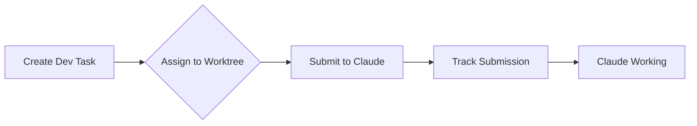
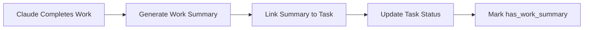
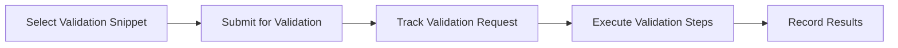
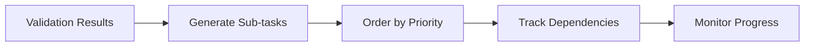

# Dev Task Tracking System - Technical Specification

**Version**: 1.0  
**Date**: June 11, 2025  
**Status**: Draft

## Executive Summary

This specification describes a comprehensive tracking system for development tasks that tightly couples dev tasks with work summaries, Claude AI submissions, validation steps, and follow-up sub-tasks. The system provides full visibility into task lifecycle from submission through completion.

## Core Requirements

The system must track and visualize:

1. **Task Submission Status**: Whether a dev task has been submitted to Claude and on which worktree
2. **Work Summary Linkage**: Direct connection between dev tasks and their resulting work summaries
3. **Validation Tracking**: Whether follow-up validation and testing have been submitted
4. **Sub-task Management**: Breaking down complex tasks into trackable sub-tasks for true completion

## Database Schema

### Primary Tables

```sql
-- Core dev task table (existing, enhanced)
dev_tasks {
  id: uuid PRIMARY KEY
  title: text
  description: text
  status: text -- 'pending', 'in_progress', 'completed', 'validated'
  priority: text
  worktree_path: text
  
  -- New tracking fields
  claude_submission_id: uuid REFERENCES claude_task_submissions(id)
  has_work_summary: boolean DEFAULT false
  has_validation_submission: boolean DEFAULT false
  has_follow_up_tasks: boolean DEFAULT false
  validation_status: text -- 'pending', 'in_progress', 'completed', 'failed'
  
  created_at: timestamp
  updated_at: timestamp
}

-- Claude submission tracking (existing, enhanced)
claude_task_submissions {
  id: uuid PRIMARY KEY
  task_id: uuid REFERENCES dev_tasks(id)
  submission_timestamp: timestamp
  worktree: text
  claude_response: text
  status: text -- 'submitted', 'in_progress', 'completed', 'failed'
  
  -- New fields
  work_summary_id: uuid REFERENCES ai_work_summaries(id)
  validation_submission_id: uuid REFERENCES validation_submissions(id)
}

-- Work summaries (existing, enhanced)
ai_work_summaries {
  id: uuid PRIMARY KEY
  title: text
  content: text
  category: text
  
  -- New linkage fields
  dev_task_id: uuid REFERENCES dev_tasks(id)
  claude_submission_id: uuid REFERENCES claude_task_submissions(id)
  
  files_modified: text[]
  commands_used: text[]
  tags: text[]
  created_at: timestamp
}

-- New: Validation submissions
validation_submissions {
  id: uuid PRIMARY KEY
  dev_task_id: uuid REFERENCES dev_tasks(id)
  submission_timestamp: timestamp
  validation_type: text -- 'completion_workflow', 'testing', 'review'
  clipboard_snippet_id: uuid REFERENCES clipboard_snippets(id)
  status: text -- 'pending', 'in_progress', 'completed', 'issues_found'
  validation_results: jsonb
  created_at: timestamp
}

-- New: Follow-up sub-tasks
dev_task_subtasks {
  id: uuid PRIMARY KEY
  parent_task_id: uuid REFERENCES dev_tasks(id)
  title: text
  description: text
  task_type: text -- 'validation', 'testing', 'documentation', 'refactoring'
  status: text -- 'pending', 'in_progress', 'completed', 'blocked'
  sequence_order: integer
  dependencies: uuid[] -- References to other subtasks
  created_from: text -- 'validation', 'manual', 'ai_suggestion'
  created_at: timestamp
  completed_at: timestamp
}

-- Clipboard snippets (existing, used for workflow)
clipboard_snippets {
  id: uuid PRIMARY KEY
  title: text
  content: text
  category: text -- Including 'dev_workflow', 'validation_checklist'
  usage_context: text[] -- ['task_submission', 'validation', 'completion']
}
```

### Relationship Views

```sql
-- Comprehensive task tracking view
CREATE VIEW dev_task_tracking_view AS
SELECT 
  dt.id,
  dt.title,
  dt.status,
  dt.worktree_path,
  dt.created_at,
  
  -- Submission status
  CASE 
    WHEN cts.id IS NOT NULL THEN 'submitted'
    ELSE 'not_submitted'
  END as submission_status,
  cts.submission_timestamp,
  cts.worktree as submission_worktree,
  
  -- Work summary status
  CASE
    WHEN aws.id IS NOT NULL THEN 'has_summary'
    ELSE 'no_summary'
  END as work_summary_status,
  aws.title as work_summary_title,
  aws.created_at as work_summary_date,
  
  -- Validation status
  CASE
    WHEN vs.id IS NOT NULL THEN 'validated'
    ELSE 'not_validated'
  END as validation_status,
  vs.submission_timestamp as validation_date,
  vs.status as validation_result,
  
  -- Sub-task status
  COUNT(dts.id) as total_subtasks,
  COUNT(dts.id) FILTER (WHERE dts.status = 'completed') as completed_subtasks,
  
  -- Overall completion status
  CASE
    WHEN dt.status = 'completed' 
      AND aws.id IS NOT NULL 
      AND vs.id IS NOT NULL
      AND COUNT(dts.id) = COUNT(dts.id) FILTER (WHERE dts.status = 'completed')
    THEN 'fully_complete'
    WHEN dt.status = 'completed' THEN 'partially_complete'
    ELSE 'incomplete'
  END as overall_status

FROM dev_tasks dt
LEFT JOIN claude_task_submissions cts ON dt.id = cts.task_id
LEFT JOIN ai_work_summaries aws ON dt.id = aws.dev_task_id
LEFT JOIN validation_submissions vs ON dt.id = vs.dev_task_id
LEFT JOIN dev_task_subtasks dts ON dt.id = dts.parent_task_id
GROUP BY dt.id, cts.id, aws.id, vs.id;
```

## Workflow Stages

### Stage 1: Task Creation & Submission



**Tracking Points**:
- Task created with ID
- Worktree assignment recorded
- Submission timestamp logged
- Claude submission ID generated

### Stage 2: Work Execution & Summary



**Tracking Points**:
- Work summary created and linked
- Files modified recorded
- Commands used logged
- Task status updated

### Stage 3: Validation Submission



**Tracking Points**:
- Validation submission created
- Clipboard snippet reference stored
- Validation type recorded
- Results captured in JSONB

### Stage 4: Follow-up Tasks



**Tracking Points**:
- Sub-tasks created from validation
- Dependencies mapped
- Progress tracked individually
- Overall completion calculated

## Status Flags & Indicators

### Primary Status Flags

1. **has_claude_submission**: Boolean indicating if task was submitted
2. **has_work_summary**: Boolean indicating if work summary exists
3. **has_validation_submission**: Boolean indicating if validation requested
4. **has_follow_up_tasks**: Boolean indicating if sub-tasks exist

### Computed Status Indicators

```sql
-- Tasks needing attention
CREATE VIEW dev_tasks_needing_action AS
SELECT 
  id,
  title,
  CASE
    WHEN claude_submission_id IS NULL THEN 'needs_submission'
    WHEN NOT has_work_summary THEN 'needs_work_summary'
    WHEN NOT has_validation_submission THEN 'needs_validation'
    WHEN has_follow_up_tasks AND EXISTS (
      SELECT 1 FROM dev_task_subtasks 
      WHERE parent_task_id = dev_tasks.id 
      AND status != 'completed'
    ) THEN 'has_incomplete_subtasks'
    ELSE 'ready_for_review'
  END as action_needed
FROM dev_tasks
WHERE status != 'completed' 
   OR NOT has_work_summary 
   OR NOT has_validation_submission;
```

## CLI Integration

### New Commands

```bash
# Check task status
./dev-tasks-cli.sh status <task-id>

# Flag tasks without summaries
./dev-tasks-cli.sh flag-incomplete --no-summary

# Flag tasks without validation
./dev-tasks-cli.sh flag-incomplete --no-validation

# Show task tracking dashboard
./dev-tasks-cli.sh tracking-dashboard

# Link work summary to task
./dev-tasks-cli.sh link-summary <task-id> <summary-id>

# Submit validation
./dev-tasks-cli.sh submit-validation <task-id> --snippet <snippet-id>
```

## Visual Dashboard Components

### Task Progress Visualization

```
Dev Task: Implement Feature X
━━━━━━━━━━━━━━━━━━━━━━━━━━━━━━━━━━━━━━━━━━━━━━━━━━━━━━━━━━━━━━

📋 Submission Status:     ✅ Submitted (2025-06-11 10:30 AM)
🌳 Worktree:             improve-cli-pipelines
📝 Work Summary:         ✅ Created (2025-06-11 11:45 AM)
🔍 Validation:           ⚠️  Not Submitted
📌 Sub-tasks:            0 created

Progress: ████████░░░░░░░░░░░░ 40%

Next Action: Submit validation using completion workflow snippet
```

### Tracking Table View

```
┌─────────────────────────┬──────────┬─────────┬──────────┬────────────┬───────────┐
│ Task Title              │ Submitted │ Worktree │ Summary  │ Validated  │ Sub-tasks │
├─────────────────────────┼──────────┼─────────┼──────────┼────────────┼───────────┤
│ Fix CLI Registry Error  │ ✅        │ improve- │ ✅       │ ✅         │ 5/5 ✅    │
│ Add Auth Integration    │ ✅        │ auth-    │ ✅       │ ⏳ Pending │ 0/0       │
│ Refactor Services       │ ❌        │ -        │ ❌       │ ❌         │ 0/0       │
│ Update Documentation    │ ✅        │ docs-    │ ⚠️ Missing│ ❌         │ 0/0       │
└─────────────────────────┴──────────┴─────────┴──────────┴────────────┴───────────┘
```

## Implementation Plan

### Phase 1: Schema Updates
1. Add tracking fields to `dev_tasks` table
2. Create `validation_submissions` table
3. Create `dev_task_subtasks` table
4. Update foreign key relationships

### Phase 2: View Creation
1. Create `dev_task_tracking_view`
2. Create `dev_tasks_needing_action` view
3. Create status aggregation views

### Phase 3: CLI Commands
1. Implement `flag-incomplete` command
2. Implement `tracking-dashboard` command
3. Implement `submit-validation` command
4. Update existing commands to populate tracking fields

### Phase 4: UI Integration
1. Update dev tasks page to show tracking status
2. Add visual indicators for each stage
3. Implement filtering by completion status
4. Add bulk action capabilities

## Success Metrics

1. **Visibility**: 100% of dev tasks have clear submission status
2. **Traceability**: Every work summary linked to originating task
3. **Completion**: Clear indication of truly "done" vs partially complete
4. **Actionability**: Always know the next required action for any task

## Example Queries

### Find Tasks Without Work Summaries
```sql
SELECT id, title, worktree_path, created_at
FROM dev_tasks
WHERE claude_submission_id IS NOT NULL
  AND NOT has_work_summary
ORDER BY created_at DESC;
```

### Find Tasks Needing Validation
```sql
SELECT dt.id, dt.title, aws.created_at as work_completed
FROM dev_tasks dt
JOIN ai_work_summaries aws ON dt.id = aws.dev_task_id
WHERE NOT dt.has_validation_submission
ORDER BY aws.created_at ASC;
```

### Calculate True Completion Rate
```sql
SELECT 
  COUNT(*) as total_tasks,
  COUNT(*) FILTER (WHERE status = 'completed') as marked_complete,
  COUNT(*) FILTER (
    WHERE status = 'completed' 
    AND has_work_summary 
    AND has_validation_submission
    AND NOT EXISTS (
      SELECT 1 FROM dev_task_subtasks 
      WHERE parent_task_id = dev_tasks.id 
      AND status != 'completed'
    )
  ) as truly_complete
FROM dev_tasks;
```

## Migration Path

1. **Existing Data**: Backfill relationships between existing dev_tasks and work_summaries
2. **Gradual Adoption**: New tracking fields nullable initially
3. **Reporting**: Generate reports on gaps in tracking
4. **Enforcement**: Eventually make key relationships required

## Conclusion

This tracking system provides comprehensive visibility into the dev task lifecycle, ensuring that no task is considered "complete" until all aspects - submission, execution, documentation, validation, and follow-up - are properly addressed and tracked.