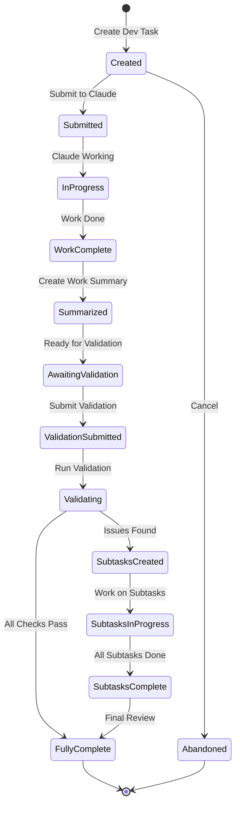

# Dev Task Tracking System - Visual Architecture

## Entity Relationship Diagram

```mermaid
erDiagram
    dev_tasks ||--o{ claude_task_submissions : "has"
    dev_tasks ||--o{ ai_work_summaries : "generates"
    dev_tasks ||--o{ validation_submissions : "requires"
    dev_tasks ||--o{ dev_task_subtasks : "breaks_into"
    
    claude_task_submissions ||--o| ai_work_summaries : "produces"
    claude_task_submissions ||--o{ validation_submissions : "triggers"
    
    validation_submissions }o--|| clipboard_snippets : "uses"
    validation_submissions ||--o{ dev_task_subtasks : "creates"
    
    dev_tasks {
        uuid id PK
        text title
        text description
        text status
        text worktree_path
        uuid claude_submission_id FK
        boolean has_work_summary
        boolean has_validation_submission
        boolean has_follow_up_tasks
        text validation_status
    }
    
    claude_task_submissions {
        uuid id PK
        uuid task_id FK
        timestamp submission_timestamp
        text worktree
        text claude_response
        text status
        uuid work_summary_id FK
        uuid validation_submission_id FK
    }
    
    ai_work_summaries {
        uuid id PK
        text title
        text content
        uuid dev_task_id FK
        uuid claude_submission_id FK
        text[] files_modified
        text[] commands_used
    }
    
    validation_submissions {
        uuid id PK
        uuid dev_task_id FK
        timestamp submission_timestamp
        text validation_type
        uuid clipboard_snippet_id FK
        text status
        jsonb validation_results
    }
    
    dev_task_subtasks {
        uuid id PK
        uuid parent_task_id FK
        text title
        text status
        text task_type
        integer sequence_order
        uuid[] dependencies
    }
    
    clipboard_snippets {
        uuid id PK
        text title
        text content
        text category
        text[] usage_context
    }
```



## Workflow State Machine



## Task Lifecycle Timeline

```
┌─────────────────────────────────────────────────────────────────────────────┐
│                          Dev Task Lifecycle Timeline                         │
├─────────────────────────────────────────────────────────────────────────────┤
│                                                                              │
│  Day 1    Day 2    Day 3    Day 4    Day 5    Day 6    Day 7    Day 8      │
│    │        │        │        │        │        │        │        │         │
│    ▼        ▼        ▼        ▼        ▼        ▼        ▼        ▼         │
│                                                                              │
│  ┌───┐                                                                       │
│  │ 1 │ Task Created                                                          │
│  └───┘                                                                       │
│    │                                                                         │
│    └──► ┌───┐                                                               │
│         │ 2 │ Submitted to Claude (Worktree: improve-cli-pipelines)         │
│         └───┘                                                               │
│           │                                                                  │
│           └────────► ┌───┐                                                  │
│                      │ 3 │ Claude Completes Work                            │
│                      └───┘                                                  │
│                        │                                                     │
│                        └──► ┌───┐                                           │
│                             │ 4 │ Work Summary Created                      │
│                             └───┘                                           │
│                               │                                              │
│                               └────────────► ┌───┐                          │
│                                              │ 5 │ Validation Submitted     │
│                                              └───┘                          │
│                                                │                             │
│                                                └──► ┌───┐                   │
│                                                     │ 6 │ Subtasks Created  │
│                                                     └───┘                   │
│                                                       │                      │
│                                                       └────────► ┌───┐      │
│                                                                  │ 7 │ Done  │
│                                                                  └───┘      │
│                                                                              │
└─────────────────────────────────────────────────────────────────────────────┘
```

## Status Dashboard Mockup

```
╔═══════════════════════════════════════════════════════════════════════════════╗
║                        Dev Task Tracking Dashboard                             ║
╠═══════════════════════════════════════════════════════════════════════════════╣
║                                                                                ║
║  📊 Overview Statistics                                                        ║
║  ┌─────────────┬─────────────┬─────────────┬─────────────┬─────────────┐    ║
║  │ Total Tasks │  Submitted  │ W/ Summary  │  Validated  │    Done     │    ║
║  │     45      │  38 (84%)   │  32 (71%)   │  28 (62%)   │  25 (56%)   │    ║
║  └─────────────┴─────────────┴─────────────┴─────────────┴─────────────┘    ║
║                                                                                ║
║  🚨 Tasks Needing Action (7)                                                   ║
║  ┌────────────────────────────────────────────┬─────────────┬──────────────┐ ║
║  │ Task                                       │ Status      │ Next Action  │ ║
║  ├────────────────────────────────────────────┼─────────────┼──────────────┤ ║
║  │ 🔴 Implement Auth Service                  │ Not Submitted│ Submit Task  │ ║
║  │ 🟡 Fix Database Connection                 │ No Summary  │ Add Summary  │ ║
║  │ 🟡 Update User Profile API                 │ No Validation│ Validate     │ ║
║  │ 🟠 Refactor Notification System            │ 3 Subtasks  │ Complete Sub │ ║
║  └────────────────────────────────────────────┴─────────────┴──────────────┘ ║
║                                                                                ║
║  📈 Progress by Worktree                                                       ║
║  ┌─────────────────────────┬──────┬──────────────────────────────────────┐  ║
║  │ Worktree                │ Tasks│ Progress                             │  ║
║  ├─────────────────────────┼──────┼──────────────────────────────────────┤  ║
║  │ improve-cli-pipelines   │  12  │ ████████████████████░░░░░ 80%        │  ║
║  │ feature-auth            │   8  │ ████████████░░░░░░░░░░░░░ 50%        │  ║
║  │ fix-performance         │   5  │ ████████████████████████░ 95%        │  ║
║  │ docs-update             │  10  │ ████████░░░░░░░░░░░░░░░░░ 35%        │  ║
║  └─────────────────────────┴──────┴──────────────────────────────────────┘  ║
║                                                                                ║
╚═══════════════════════════════════════════════════════════════════════════════╝
```

## Tracking Matrix

| Stage | Database Field | UI Indicator | CLI Command | Automation |
|-------|---------------|--------------|-------------|------------|
| Task Created | `dev_tasks.id` | 📋 | `create` | - |
| Submitted | `claude_submission_id` | ✅ | `submit` | Auto-track |
| Work Complete | `has_work_summary` | 📝 | `link-summary` | Git hook |
| Validated | `has_validation_submission` | 🔍 | `submit-validation` | - |
| Subtasks Done | `subtask completion %` | 📌 | `complete-subtask` | Progress calc |
| Fully Complete | Computed field | 🎉 | `complete` | All checks |

## Query Examples for Common Scenarios

### 1. "Show me all tasks I've submitted but haven't documented"
```sql
SELECT 
  dt.title,
  dt.worktree_path,
  cts.submission_timestamp,
  CURRENT_TIMESTAMP - cts.submission_timestamp as time_elapsed
FROM dev_tasks dt
JOIN claude_task_submissions cts ON dt.id = cts.task_id
WHERE NOT dt.has_work_summary
ORDER BY cts.submission_timestamp ASC;
```

### 2. "Which tasks are stuck in validation?"
```sql
SELECT 
  dt.title,
  vs.submission_timestamp,
  vs.status,
  vs.validation_results
FROM dev_tasks dt
JOIN validation_submissions vs ON dt.id = vs.dev_task_id
WHERE vs.status IN ('in_progress', 'issues_found')
  AND vs.submission_timestamp < CURRENT_TIMESTAMP - INTERVAL '2 days';
```

### 3. "Show my true completion rate this week"
```sql
WITH weekly_tasks AS (
  SELECT 
    dt.*,
    CASE 
      WHEN dt.status = 'completed' 
        AND dt.has_work_summary 
        AND dt.has_validation_submission
        AND NOT EXISTS (
          SELECT 1 FROM dev_task_subtasks 
          WHERE parent_task_id = dt.id 
          AND status != 'completed'
        )
      THEN 'truly_complete'
      ELSE 'incomplete'
    END as true_status
  FROM dev_tasks dt
  WHERE dt.created_at >= CURRENT_DATE - INTERVAL '7 days'
)
SELECT 
  COUNT(*) as total_tasks,
  COUNT(*) FILTER (WHERE true_status = 'truly_complete') as truly_complete,
  ROUND(
    100.0 * COUNT(*) FILTER (WHERE true_status = 'truly_complete') / COUNT(*), 
    1
  ) as completion_percentage
FROM weekly_tasks;
```

## Implementation Priority

1. **High Priority** (Week 1)
   - Add tracking fields to `dev_tasks`
   - Create `validation_submissions` table
   - Implement `flag-incomplete` CLI command

2. **Medium Priority** (Week 2)
   - Create tracking views
   - Implement `tracking-dashboard` command
   - Add basic UI indicators

3. **Low Priority** (Week 3+)
   - Automated validation triggers
   - Subtask dependency management
   - Advanced analytics views