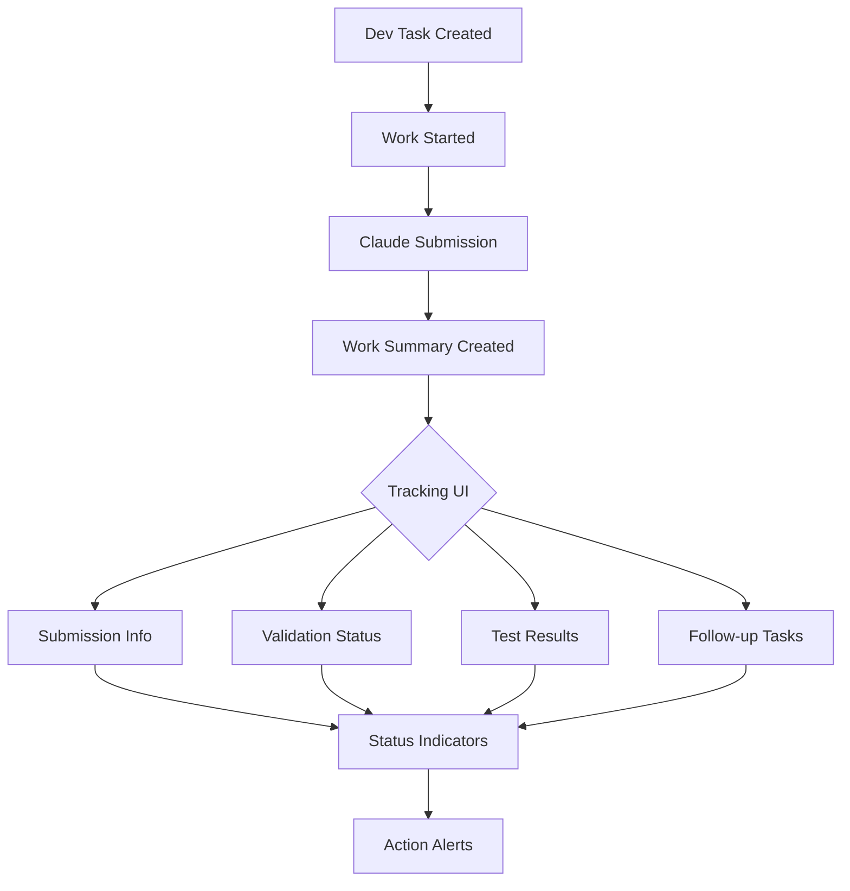

# Dev Tasks Comprehensive Guide V2
*Updated: June 11, 2025*
*Previous Version: June 9, 2025*

## Changes in V2
- Added comprehensive work summary tracking UI integration
- Enhanced submission tracking with Claude Code metadata
- Incorporated validation and test result visualization
- Added follow-up task management and progress tracking
- Integrated visual status indicators and action management

## Table of Contents
1. [System Overview](#1-system-overview)
2. [Core Architecture](#2-core-architecture)
3. [Work Summary Tracking Integration](#3-work-summary-tracking-integration)
4. [Database Schema](#4-database-schema)
5. [UI Components](#5-ui-components)
6. [CLI Commands](#6-cli-commands)
7. [Workflow Examples](#7-workflow-examples)
8. [Best Practices](#8-best-practices)
9. [Troubleshooting](#9-troubleshooting)
10. [Future Enhancements](#10-future-enhancements)

## 1. System Overview

### 1.1 Purpose
The Dev Tasks system provides comprehensive task management with full lifecycle tracking, work summary visualization, and automated follow-up management for development workflows.

### 1.2 Key Features
- **Task Lifecycle Management**: Track tasks from creation to completion
- **Work Summary Tracking**: Visual UI showing all task-related activities
- **Submission Monitoring**: Track Claude Code submissions with metadata
- **Validation & Testing**: Monitor test results and validation status
- **Follow-up Automation**: Create and track follow-up tasks
- **Git Integration**: Link commits, branches, and worktrees
- **Visual Indicators**: Status dots, progress bars, and action alerts

### 1.3 System Components
```
┌─────────────────────────────────────────────────────────┐
│                    Dev Tasks System                      │
├─────────────────┬──────────────────┬───────────────────┤
│   Task Engine   │  Tracking Layer  │    UI Layer       │
├─────────────────┼──────────────────┼───────────────────┤
│ • Lifecycle Mgmt│ • Submissions     │ • WorkSummaryCard │
│ • State Machine │ • Validations     │ • Status Indicators│
│ • Priorities    │ • Test Results    │ • Progress Tracking│
│ • Dependencies  │ • Git Integration │ • Action Alerts   │
└─────────────────┴──────────────────┴───────────────────┘
```

## 2. Core Architecture

### 2.1 Task States
```typescript
enum TaskState {
  CREATED = 'created',
  ASSIGNED = 'assigned',
  IN_PROGRESS = 'in_progress',
  SUBMITTED = 'submitted',        // NEW: Claude submission
  VALIDATING = 'validating',      // NEW: Validation phase
  TESTING = 'testing',            // NEW: Testing phase
  DOCUMENTING = 'documenting',    // NEW: Documentation phase
  COMPLETED = 'completed',
  CANCELLED = 'cancelled'
}
```

### 2.2 Task Types
```typescript
enum TaskType {
  FEATURE = 'feature',
  BUG_FIX = 'bug_fix',
  REFACTOR = 'refactor',
  DOCUMENTATION = 'documentation',
  VALIDATION = 'validation',      // NEW: Follow-up type
  TESTING = 'testing',            // NEW: Follow-up type
  INVESTIGATION = 'investigation'
}
```

### 2.3 Component Architecture
```typescript
// Core services
interface DevTaskSystem {
  taskService: TaskService;
  trackingService: TrackingService;
  workSummaryService: WorkSummaryService;
  validationService: ValidationService;
  testingService: TestingService;
  followUpService: FollowUpService;
}

// UI components
interface DevTaskUI {
  WorkSummaryCard: React.FC<WorkSummaryCardProps>;
  StatusIndicators: React.FC<StatusIndicatorProps>;
  ProgressTracker: React.FC<ProgressTrackerProps>;
  TodoChecklist: React.FC<TodoChecklistProps>;
  ActionAlerts: React.FC<ActionAlertProps>;
}
```

## 3. Work Summary Tracking Integration

### 3.1 Tracking Data Flow


### 3.2 Work Summary Card Structure
```typescript
interface WorkSummaryTracking {
  // Core information
  devTask: {
    id: string;
    title: string;
    shortName: string;  // First 50 chars or custom
    url: string;        // Link to task detail
  };
  
  // Submission tracking
  submission: {
    timestamp: Date;
    worktree: string;
    gitCommit?: string;
    gitCommitUrl?: string;
    status: 'pending' | 'completed' | 'failed';
  };
  
  // Follow-up tracking
  validation: {
    submitted: boolean;
    timestamp?: Date;
    status?: 'passed' | 'failed' | 'issues_found';
    summary?: string;
    issuesCount?: number;
  };
  
  testing: {
    submitted: boolean;
    timestamp?: Date;
    passed?: number;
    failed?: number;
    coverage?: number;
    reportUrl?: string;
  };
  
  documentation: {
    submitted: boolean;
    timestamp?: Date;
    status?: 'updated' | 'pending' | 'skipped';
  };
  
  // Progress tracking
  todos: Array<{
    id: string;
    text: string;
    completed: boolean;
    priority: 'high' | 'medium' | 'low';
  }>;
  
  // Action management
  needsAction: boolean;
  actionReason?: string;
  suggestedActions?: string[];
}
```

### 3.3 Visual Design System
```scss
// Status indicator colors
.status-indicator {
  &.not-started { background: #6B7280; }  // Gray
  &.in-progress { background: #F59E0B; }  // Yellow
  &.completed { background: #10B981; }    // Green
  &.failed { background: #EF4444; }       // Red
  &.needs-action { background: #F97316; } // Orange
}

// Card layout
.work-summary-card {
  display: grid;
  grid-template-areas:
    "header header"
    "status indicators"
    "content content"
    "actions actions";
  gap: 1rem;
  padding: 1.5rem;
  border: 1px solid #E5E7EB;
  border-radius: 0.5rem;
  
  &.needs-action {
    border-color: #F97316;
    box-shadow: 0 0 0 3px rgba(249, 115, 22, 0.1);
  }
}
```

## 4. Database Schema

### 4.1 Core Tables
```sql
-- Enhanced dev_tasks with tracking fields
CREATE TABLE dev_tasks (
  id UUID PRIMARY KEY DEFAULT gen_random_uuid(),
  title TEXT NOT NULL,
  description TEXT,
  status TEXT NOT NULL DEFAULT 'created',
  priority TEXT DEFAULT 'medium',
  type TEXT NOT NULL,
  
  -- Work summary tracking
  work_summary_count INTEGER DEFAULT 0,
  last_work_summary_at TIMESTAMPTZ,
  
  -- Submission tracking
  claude_submission_id UUID,
  claude_submission_timestamp TIMESTAMPTZ,
  claude_submission_worktree TEXT,
  claude_submission_status TEXT,
  
  -- Validation tracking
  validation_submission_id UUID,
  validation_submission_timestamp TIMESTAMPTZ,
  validation_status TEXT,
  
  -- Test tracking
  test_submission_id UUID,
  test_submission_timestamp TIMESTAMPTZ,
  test_status TEXT,
  
  -- Git tracking
  git_branch_created TEXT,
  git_branch_current TEXT,
  git_commits_count INTEGER DEFAULT 0,
  git_commit_first TEXT,
  git_commit_current TEXT,
  worktree TEXT,
  
  -- Metadata
  created_at TIMESTAMPTZ DEFAULT NOW(),
  updated_at TIMESTAMPTZ DEFAULT NOW(),
  completed_at TIMESTAMPTZ
);

-- Work summary enhancements
ALTER TABLE ai_work_summaries 
ADD COLUMN dev_task_id UUID REFERENCES dev_tasks(id),
ADD COLUMN validation_status TEXT,
ADD COLUMN has_tests BOOLEAN DEFAULT false,
ADD COLUMN test_results_id UUID;

-- Comprehensive tracking tables
CREATE TABLE work_summary_validations (
  id UUID PRIMARY KEY DEFAULT gen_random_uuid(),
  work_summary_id UUID REFERENCES ai_work_summaries(id),
  dev_task_id UUID REFERENCES dev_tasks(id),
  validated_at TIMESTAMPTZ DEFAULT NOW(),
  validation_status TEXT NOT NULL,
  validation_summary TEXT,
  issues JSONB DEFAULT '[]',
  validator_type TEXT DEFAULT 'manual'
);

CREATE TABLE test_results (
  id UUID PRIMARY KEY DEFAULT gen_random_uuid(),
  dev_task_id UUID REFERENCES dev_tasks(id),
  work_summary_id UUID REFERENCES ai_work_summaries(id),
  test_suite_name TEXT,
  passed_count INTEGER DEFAULT 0,
  failed_count INTEGER DEFAULT 0,
  skipped_count INTEGER DEFAULT 0,
  total_count INTEGER DEFAULT 0,
  coverage_percentage DECIMAL(5,2),
  execution_time_ms INTEGER,
  report_url TEXT,
  test_output JSONB,
  created_at TIMESTAMPTZ DEFAULT NOW()
);

CREATE TABLE dev_task_follow_ups (
  id UUID PRIMARY KEY DEFAULT gen_random_uuid(),
  parent_task_id UUID REFERENCES dev_tasks(id),
  follow_up_task_id UUID REFERENCES dev_tasks(id),
  follow_up_type TEXT,
  priority TEXT DEFAULT 'medium',
  follow_up_summary TEXT,
  created_at TIMESTAMPTZ DEFAULT NOW()
);
```

### 4.2 Tracking Views
```sql
-- Comprehensive work summary tracking view
CREATE OR REPLACE VIEW work_summary_tracking_dashboard AS
SELECT 
  ws.*,
  dt.title as task_title,
  dt.status as task_status,
  dt.claude_submission_timestamp,
  dt.claude_submission_worktree,
  dt.git_commit_current,
  wsv.validation_status,
  wsv.validated_at,
  wsv.issues as validation_issues,
  tr.passed_count as tests_passed,
  tr.failed_count as tests_failed,
  tr.coverage_percentage as test_coverage,
  tr.report_url as test_report_url,
  COUNT(DISTINCT dtf.id) as follow_up_count,
  COUNT(DISTINCT dtf.id) FILTER (WHERE ft.status = 'completed') as follow_ups_completed,
  CASE
    WHEN tr.failed_count > 0 THEN true
    WHEN wsv.validation_status = 'issues_found' THEN true
    WHEN COUNT(DISTINCT dtf.id) > COUNT(DISTINCT dtf.id) FILTER (WHERE ft.status = 'completed') THEN true
    ELSE false
  END as needs_action
FROM ai_work_summaries ws
LEFT JOIN dev_tasks dt ON ws.dev_task_id = dt.id
LEFT JOIN work_summary_validations wsv ON ws.id = wsv.work_summary_id
LEFT JOIN test_results tr ON ws.id = tr.work_summary_id
LEFT JOIN dev_task_follow_ups dtf ON dt.id = dtf.parent_task_id
LEFT JOIN dev_tasks ft ON dtf.follow_up_task_id = ft.id
GROUP BY ws.id, dt.id, wsv.id, tr.id;
```

## 5. UI Components

### 5.1 WorkSummaryCard Component
```typescript
import React from 'react';
import { 
  Calendar, Tag, GitBranch, CheckCircle, 
  XCircle, AlertCircle, FileText, ExternalLink,
  GitCommit, TestTube, BookOpen, Clock
} from 'lucide-react';

interface WorkSummaryCardProps {
  summary: WorkSummary;
  tracking: WorkSummaryTracking;
  onToggleTodo: (todoId: string) => void;
  onCreateFollowUp: (type: string) => void;
  expanded: boolean;
  onToggleExpanded: () => void;
}

export const WorkSummaryCard: React.FC<WorkSummaryCardProps> = ({
  summary,
  tracking,
  onToggleTodo,
  onCreateFollowUp,
  expanded,
  onToggleExpanded
}) => {
  return (
    <div className={`work-summary-card ${tracking.needsAction ? 'needs-action' : ''}`}>
      {/* Header with task link */}
      <div className="card-header">
        <h3>
          <a href={tracking.devTask.url}>
            {tracking.devTask.shortName}
          </a>
        </h3>
        <StatusIndicators {...tracking} />
      </div>
      
      {/* Submission info */}
      <div className="submission-info">
        <Clock className="icon" />
        <span>Submitted {formatDate(tracking.submission.timestamp)}</span>
        <span className="worktree">{tracking.submission.worktree}</span>
        {tracking.submission.gitCommit && (
          <a href={tracking.submission.gitCommitUrl}>
            <GitCommit className="icon" />
            {tracking.submission.gitCommit.slice(0, 7)}
          </a>
        )}
      </div>
      
      {/* Summary content */}
      <div className="summary-content">
        {expanded ? summary.content : summary.content.slice(0, 200) + '...'}
      </div>
      
      {/* Follow-up status */}
      <div className="follow-up-status">
        <ValidationStatus {...tracking.validation} />
        <TestStatus {...tracking.testing} />
        <DocumentationStatus {...tracking.documentation} />
      </div>
      
      {/* Todo checklist */}
      {tracking.todos.length > 0 && (
        <TodoChecklist 
          todos={tracking.todos}
          onToggle={onToggleTodo}
        />
      )}
      
      {/* Action alerts */}
      {tracking.needsAction && (
        <ActionAlert 
          reason={tracking.actionReason}
          actions={tracking.suggestedActions}
          onCreateFollowUp={onCreateFollowUp}
        />
      )}
    </div>
  );
};
```

### 5.2 Status Indicators Component
```typescript
interface StatusIndicatorsProps {
  submission: { status: string };
  validation: { submitted: boolean; status?: string };
  testing: { submitted: boolean; failed?: number };
  documentation: { submitted: boolean };
}

const StatusIndicators: React.FC<StatusIndicatorsProps> = (props) => {
  return (
    <div className="status-indicators">
      <StatusDot 
        status={props.submission.status} 
        tooltip="Submission status"
      />
      <StatusDot 
        status={getValidationStatus(props.validation)} 
        tooltip="Validation status"
      />
      <StatusDot 
        status={getTestStatus(props.testing)} 
        tooltip="Test status"
      />
      <StatusDot 
        status={getDocStatus(props.documentation)} 
        tooltip="Documentation status"
      />
    </div>
  );
};
```

### 5.3 Todo Checklist Component
```typescript
interface TodoChecklistProps {
  todos: TodoItem[];
  onToggle: (todoId: string) => void;
  onAdd?: (text: string) => void;
}

const TodoChecklist: React.FC<TodoChecklistProps> = ({
  todos,
  onToggle,
  onAdd
}) => {
  const progress = (todos.filter(t => t.completed).length / todos.length) * 100;
  
  return (
    <div className="todo-checklist">
      <div className="checklist-header">
        <h4>Follow-up Tasks</h4>
        <ProgressBar value={progress} />
      </div>
      <ul className="todo-list">
        {todos.map(todo => (
          <li key={todo.id} className={todo.completed ? 'completed' : ''}>
            <input
              type="checkbox"
              checked={todo.completed}
              onChange={() => onToggle(todo.id)}
            />
            <span className={`priority-${todo.priority}`}>
              {todo.text}
            </span>
          </li>
        ))}
      </ul>
      {onAdd && <AddTodoForm onAdd={onAdd} />}
    </div>
  );
};
```

## 6. CLI Commands

### 6.1 Task Management
```bash
# Create task with auto work summary generation
dev-tasks-cli.sh create \
  --title "Implement user authentication" \
  --type feature \
  --priority high \
  --auto-work-summary

# Show task with tracking info
dev-tasks-cli.sh show <task-id> --tracking

# List tasks needing action
dev-tasks-cli.sh list --needs-action

# Update task status with submission tracking
dev-tasks-cli.sh update <task-id> \
  --status submitted \
  --submission-worktree ~/dhg-mono-improve-cli
```

### 6.2 Work Summary Commands
```bash
# Create work summary with task link
dev-tasks-cli.sh create-summary \
  --task <task-id> \
  --title "Implemented authentication flow" \
  --content "..." \
  --commit abc123

# Add validation results
dev-tasks-cli.sh add-validation <task-id> \
  --status passed \
  --summary "All checks passed"

# Add test results
dev-tasks-cli.sh add-tests <task-id> \
  --passed 45 \
  --failed 5 \
  --coverage 85.5 \
  --report-url "https://..."
```

### 6.3 Follow-up Management
```bash
# Create follow-up task
dev-tasks-cli.sh create-follow-up <parent-id> \
  --type validation \
  --title "Fix validation errors" \
  --priority high

# List follow-up tasks
dev-tasks-cli.sh list-follow-ups <task-id>

# Complete follow-up with summary
dev-tasks-cli.sh complete-follow-up <follow-up-id> \
  --summary "Fixed all validation errors"
```

## 7. Workflow Examples

### 7.1 Complete Task Workflow
```bash
# 1. Create task
TASK_ID=$(dev-tasks-cli.sh create \
  --title "Add search functionality" \
  --type feature \
  --output id)

# 2. Start work
dev-tasks-cli.sh start $TASK_ID \
  --worktree ~/dhg-mono-search

# 3. Make commits
git add .
git commit -m "feat: implement search API

Task: #$TASK_ID"

# 4. Submit to Claude
dev-tasks-cli.sh submit $TASK_ID \
  --type implementation

# 5. Create work summary
dev-tasks-cli.sh create-summary \
  --task $TASK_ID \
  --auto  # Auto-generate from git history

# 6. Run validation
dev-tasks-cli.sh validate $TASK_ID

# 7. Run tests
dev-tasks-cli.sh test $TASK_ID

# 8. Update documentation
dev-tasks-cli.sh document $TASK_ID

# 9. Complete task
dev-tasks-cli.sh complete $TASK_ID
```

### 7.2 Handling Failed Tests
```bash
# Test results show failures
dev-tasks-cli.sh add-tests $TASK_ID \
  --passed 40 \
  --failed 10 \
  --coverage 75

# System auto-creates follow-up
FOLLOW_UP_ID=$(dev-tasks-cli.sh list-follow-ups $TASK_ID \
  --type testing \
  --output id)

# Work on follow-up
dev-tasks-cli.sh start $FOLLOW_UP_ID

# Fix tests and update
dev-tasks-cli.sh add-tests $FOLLOW_UP_ID \
  --passed 50 \
  --failed 0 \
  --coverage 85

# Complete follow-up
dev-tasks-cli.sh complete $FOLLOW_UP_ID
```

## 8. Best Practices

### 8.1 Task Creation
- Use descriptive titles (50-100 characters)
- Select appropriate type and priority
- Link to parent tasks for follow-ups
- Enable auto work summary for complex tasks

### 8.2 Work Summary Quality
- Include specific changes made
- Reference commits and files
- Describe validation/test results
- List any issues or blockers

### 8.3 Follow-up Management
- Auto-create for failed tests/validation
- Set appropriate priorities
- Link to original task
- Track progress with todos

### 8.4 UI Optimization
- Use status indicators for quick scanning
- Expand cards only when needed
- Focus on actionable items
- Keep summaries concise

## 9. Troubleshooting

### 9.1 Common Issues

**Missing Work Summary Link**
```sql
-- Find orphaned work summaries
SELECT * FROM ai_work_summaries 
WHERE dev_task_id IS NULL 
AND content LIKE '%Task:%';

-- Link based on content
UPDATE ai_work_summaries 
SET dev_task_id = <task-id>
WHERE id = <summary-id>;
```

**Incorrect Status Indicators**
```bash
# Refresh task tracking
dev-tasks-cli.sh refresh-tracking <task-id>

# Manually update status
dev-tasks-cli.sh update-status <task-id> \
  --validation passed \
  --testing passed
```

**Missing Follow-up Tasks**
```bash
# Check for needed follow-ups
dev-tasks-cli.sh check-follow-ups <task-id>

# Manually create if needed
dev-tasks-cli.sh create-follow-up <task-id> \
  --type validation \
  --auto-detect
```

### 9.2 Performance Issues

**Slow Work Summary Loading**
```sql
-- Check indexes
EXPLAIN ANALYZE
SELECT * FROM work_summary_tracking_dashboard
WHERE created_at > NOW() - INTERVAL '7 days';

-- Add missing indexes
CREATE INDEX CONCURRENTLY idx_work_summaries_created 
ON ai_work_summaries(created_at DESC);
```

**Large Todo Lists**
```typescript
// Paginate todos
const paginatedTodos = usePagination(tracking.todos, {
  pageSize: 10,
  initialPage: 1
});
```

## 10. Future Enhancements

### 10.1 Short Term (Next Sprint)
- Auto-detection of task references in commits
- Bulk actions for multiple summaries
- Enhanced search and filtering
- Mobile-responsive card design

### 10.2 Medium Term (Next Quarter)
- AI-powered summary generation
- Predictive follow-up creation
- Integration with CI/CD pipelines
- Real-time collaboration features

### 10.3 Long Term (Next Year)
- Machine learning for task estimation
- Automated workflow optimization
- Cross-project task dependencies
- Advanced analytics dashboard

## Appendix A: Database Migrations

```sql
-- V2 Migration: Add work summary tracking
BEGIN;

-- Add tracking fields to dev_tasks
ALTER TABLE dev_tasks 
ADD COLUMN IF NOT EXISTS work_summary_count INTEGER DEFAULT 0,
ADD COLUMN IF NOT EXISTS last_work_summary_at TIMESTAMPTZ,
ADD COLUMN IF NOT EXISTS validation_submission_id UUID,
ADD COLUMN IF NOT EXISTS test_submission_id UUID;

-- Add task reference to work summaries
ALTER TABLE ai_work_summaries 
ADD COLUMN IF NOT EXISTS dev_task_id UUID REFERENCES dev_tasks(id),
ADD COLUMN IF NOT EXISTS validation_status TEXT,
ADD COLUMN IF NOT EXISTS has_tests BOOLEAN DEFAULT false;

-- Create new tracking tables
CREATE TABLE IF NOT EXISTS work_summary_validations (
  id UUID PRIMARY KEY DEFAULT gen_random_uuid(),
  work_summary_id UUID REFERENCES ai_work_summaries(id),
  dev_task_id UUID REFERENCES dev_tasks(id),
  validated_at TIMESTAMPTZ DEFAULT NOW(),
  validation_status TEXT NOT NULL,
  validation_summary TEXT,
  issues JSONB DEFAULT '[]'
);

CREATE TABLE IF NOT EXISTS test_results (
  id UUID PRIMARY KEY DEFAULT gen_random_uuid(),
  dev_task_id UUID REFERENCES dev_tasks(id),
  work_summary_id UUID REFERENCES ai_work_summaries(id),
  test_suite_name TEXT,
  passed_count INTEGER DEFAULT 0,
  failed_count INTEGER DEFAULT 0,
  coverage_percentage DECIMAL(5,2),
  report_url TEXT,
  created_at TIMESTAMPTZ DEFAULT NOW()
);

-- Create tracking view
CREATE OR REPLACE VIEW work_summary_tracking_view AS
-- [View definition from section 4.2]

COMMIT;
```

## Appendix B: Component Examples

### WorkSummaryCard Usage
```typescript
import { WorkSummaryCard } from '@components/WorkSummaryCard';
import { useWorkSummaryTracking } from '@hooks/useWorkSummaryTracking';

function WorkSummariesPage() {
  const { summaries, loading } = useWorkSummaries();
  
  return (
    <div className="work-summaries-grid">
      {summaries.map(summary => (
        <TrackedWorkSummary 
          key={summary.id} 
          summary={summary} 
        />
      ))}
    </div>
  );
}

function TrackedWorkSummary({ summary }) {
  const tracking = useWorkSummaryTracking(summary.id);
  const [expanded, setExpanded] = useState(false);
  
  return (
    <WorkSummaryCard
      summary={summary}
      tracking={tracking}
      expanded={expanded}
      onToggleExpanded={() => setExpanded(!expanded)}
      onToggleTodo={tracking.toggleTodo}
      onCreateFollowUp={tracking.createFollowUp}
    />
  );
}
```

This comprehensive guide provides a complete reference for the enhanced Dev Tasks system with integrated work summary tracking UI.