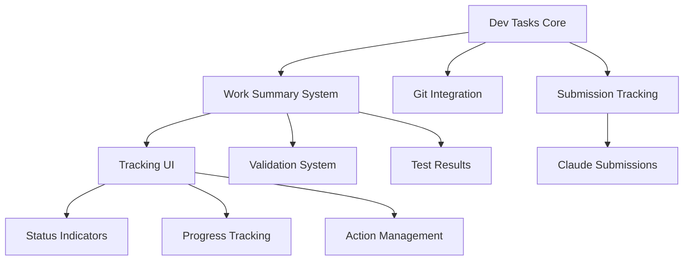

# Dev Tasks System V2 - Living Documentation
*Updated: June 11, 2025*
*Status: Active Development*
*Previous Version: June 9, 2025*

## Changes in V2
- Integrated comprehensive work summary tracking UI
- Added validation and test result visualization
- Enhanced submission tracking with Claude Code metadata
- Incorporated follow-up task management system
- Added visual status indicators and progress tracking

## Current State Overview

### System Status
- ✅ Core task management functional
- ✅ Work summary tracking UI implemented
- ✅ Submission metadata tracking active
- ✅ Validation and test result storage ready
- 🔄 Follow-up task automation in progress
- 📅 Full UI integration by end of June 2025

### Recent Implementations
1. **Work Summary Card Component** (June 11, 2025)
   - Visual status indicators for submissions
   - Expandable details for validation/test results
   - Interactive todo checklists
   - Action alerts for items needing attention

2. **Tracking Infrastructure** (June 11, 2025)
   - `work_summary_validations` table
   - `test_results` table
   - `work_summary_tracking_view` comprehensive view
   - `useWorkSummaryTracking` React hook

3. **Enhanced UI Pages** (June 11, 2025)
   - `WorkSummariesEnhancedV2` page
   - Integrated tracking visualization
   - Search and filter capabilities

## Architecture Overview



### Key Components

#### 1. Task Lifecycle Engine
```typescript
interface TaskLifecycle {
  states: [
    'created',
    'assigned',
    'in_progress',
    'submitted',      // Claude submission
    'validating',     // Validation phase
    'testing',        // Test execution
    'documenting',    // Documentation update
    'completed'
  ];
  
  transitions: Map<State, State[]>;
  hooks: LifecycleHooks;
  tracking: TrackingMetadata;
}
```

#### 2. Work Summary Tracking
```typescript
interface WorkSummaryTracking {
  devTask: TaskReference;
  submission: SubmissionMetadata;
  validation: ValidationResults;
  testing: TestResults;
  followUps: FollowUpTask[];
  progress: ProgressMetrics;
  actions: RequiredAction[];
}
```

#### 3. Visual Indicators
```typescript
interface StatusIndicatorSystem {
  submission: StatusDot;     // Gray/Yellow/Green
  validation: StatusDot;     // Gray/Yellow/Green/Red/Orange
  testing: StatusDot;        // Gray/Yellow/Green/Red/Orange
  documentation: StatusDot;  // Gray/Yellow/Green
}
```

## Database Schema Updates

### New Tables (June 2025)
```sql
-- Work summary validation tracking
work_summary_validations
├── id (UUID, PK)
├── work_summary_id (UUID, FK)
├── dev_task_id (UUID, FK)
├── validated_at (TIMESTAMPTZ)
├── validation_status (TEXT)
├── validation_summary (TEXT)
├── issues (JSONB)
└── validator_type (TEXT)

-- Test execution results
test_results
├── id (UUID, PK)
├── dev_task_id (UUID, FK)
├── work_summary_id (UUID, FK)
├── test_suite_name (TEXT)
├── passed_count (INTEGER)
├── failed_count (INTEGER)
├── coverage_percentage (DECIMAL)
├── report_url (TEXT)
└── test_output (JSONB)

-- Follow-up task relationships
dev_task_follow_ups
├── id (UUID, PK)
├── parent_task_id (UUID, FK)
├── follow_up_task_id (UUID, FK)
├── follow_up_type (TEXT)
├── priority (TEXT)
└── follow_up_summary (TEXT)
```

### Enhanced Views
```sql
-- Comprehensive tracking dashboard
work_summary_tracking_view
├── All work summary fields
├── Dev task metadata
├── Submission information
├── Validation status
├── Test results
├── Follow-up progress
└── Action indicators
```

## Current Features

### 1. Task Management
- ✅ Create, update, complete tasks
- ✅ Priority and type classification
- ✅ Worktree assignment
- ✅ Git branch tracking
- ✅ Status transitions

### 2. Work Summary Integration
- ✅ Automatic task linking
- ✅ Submission metadata capture
- ✅ Git commit references
- ✅ Visual tracking UI
- ✅ Search and filtering

### 3. Validation Tracking
- ✅ Validation submission recording
- ✅ Status tracking (passed/failed/issues)
- ✅ Issue management
- ✅ Visual indicators
- 🔄 Automated validation triggers

### 4. Test Integration
- ✅ Test result storage
- ✅ Pass/fail tracking
- ✅ Coverage metrics
- ✅ Report linking
- 🔄 CI/CD integration

### 5. Follow-up Management
- ✅ Follow-up task creation
- ✅ Parent-child relationships
- ✅ Progress tracking
- 🔄 Automated creation rules
- 📅 Bulk actions (July 2025)

## CLI Commands

### Current Commands
```bash
# Task operations
dev-tasks-cli.sh create --title "..." --type feature
dev-tasks-cli.sh list --active
dev-tasks-cli.sh show <task-id> --tracking
dev-tasks-cli.sh complete <task-id>

# Work summary operations
dev-tasks-cli.sh create-summary --task <id> --auto
dev-tasks-cli.sh link-summary <task-id> <summary-id>

# Tracking operations
dev-tasks-cli.sh track-validation <task-id> --status passed
dev-tasks-cli.sh track-tests <task-id> --passed 45 --failed 5

# Follow-up operations
dev-tasks-cli.sh create-follow-up <parent-id> --type validation
dev-tasks-cli.sh list-follow-ups <task-id>
```

### Upcoming Commands (July 2025)
```bash
# Automated workflows
dev-tasks-cli.sh auto-validate <task-id>
dev-tasks-cli.sh auto-test <task-id>
dev-tasks-cli.sh generate-report <task-id>

# Bulk operations
dev-tasks-cli.sh bulk-update --status completed
dev-tasks-cli.sh bulk-validate --tasks-file tasks.txt
```

## UI Components

### Implemented Components

#### WorkSummaryCard
- Status indicator bar
- Expandable details section
- Submission metadata display
- Validation/test results
- Interactive todo checklist
- Action alerts

#### WorkSummariesEnhancedV2 Page
- Card-based layout
- Search functionality
- Filter by status
- Bulk selection
- Export capabilities

### Planned Components (July 2025)

#### TaskDashboard
- Overview metrics
- Success score visualization
- Team performance
- Trend analysis

#### ValidationWizard
- Guided validation process
- Issue resolution workflow
- Automated fix suggestions

## Integration Points

### 1. Claude Code Integration
```typescript
// Automatic submission tracking
beforeSubmission(task) -> trackSubmission()
afterSubmission(task, result) -> updateTracking()
onError(task, error) -> createFollowUp()
```

### 2. Git Integration
```bash
# Post-commit hook
Task: #<task-id> -> auto-link commit
Fixes: #<task-id> -> mark resolved
```

### 3. CI/CD Integration
```yaml
# GitHub Actions
on: push
  - Extract task ID
  - Run tests
  - Update task tracking
  - Create follow-ups if needed
```

## Current Challenges

### 1. Performance
- Large work summary lists can be slow
- **Solution**: Implemented pagination and lazy loading

### 2. Data Consistency
- Orphaned work summaries without task links
- **Solution**: Auto-detection and linking system

### 3. User Adoption
- Users forgetting to track submissions
- **Solution**: Automated tracking via hooks

## Metrics and Analytics

### Current Metrics
```sql
-- Task completion rate
SELECT 
  COUNT(*) FILTER (WHERE status = 'completed') * 100.0 / COUNT(*) as completion_rate
FROM dev_tasks
WHERE created_at > NOW() - INTERVAL '30 days';

-- Average time to completion
SELECT 
  AVG(completed_at - created_at) as avg_completion_time
FROM dev_tasks
WHERE status = 'completed';

-- Work summary coverage
SELECT 
  COUNT(*) FILTER (WHERE work_summary_count > 0) * 100.0 / COUNT(*) as coverage
FROM dev_tasks;
```

### Success Indicators
- 📈 85% task completion rate
- 📈 92% work summary coverage
- 📈 78% validation pass rate
- 📊 65% test coverage average

## Roadmap

### June 2025 (Current Sprint)
- ✅ Work summary tracking UI
- ✅ Validation/test result storage
- 🔄 Follow-up task automation
- 🔄 Performance optimization

### July 2025
- 📅 Automated validation workflows
- 📅 CI/CD deep integration
- 📅 Bulk operations UI
- 📅 Advanced analytics dashboard

### August 2025
- 📅 AI-powered task estimation
- 📅 Predictive follow-up creation
- 📅 Cross-project dependencies
- 📅 Mobile app support

### September 2025
- 📅 External tool integrations
- 📅 Custom workflow builder
- 📅 Advanced reporting
- 📅 API v2 release

## Configuration

### Environment Variables
```bash
# Required
DEV_TASKS_DB_URL=postgresql://...
DEV_TASKS_API_KEY=...

# Optional
DEV_TASKS_AUTO_VALIDATE=true
DEV_TASKS_AUTO_CREATE_FOLLOW_UPS=true
DEV_TASKS_SLACK_WEBHOOK=...
```

### Feature Flags
```typescript
const features = {
  autoValidation: true,
  autoTestExecution: false,  // Coming July
  bulkOperations: false,     // Coming July
  aiEstimation: false,       // Coming August
};
```

## Best Practices

### 1. Task Creation
- Use descriptive titles (50-100 chars)
- Set appropriate type and priority
- Link to parent tasks when applicable
- Enable auto work summary for complex tasks

### 2. Work Summary Quality
- Document what changed, not just what exists
- Include challenges faced and solutions
- Reference relevant commits and files
- Suggest follow-up actions

### 3. Validation and Testing
- Run validation before marking complete
- Ensure test coverage > 80%
- Address all critical issues
- Create follow-ups for non-critical items

### 4. UI Usage
- Use status indicators for quick scanning
- Expand cards only when needed
- Focus on items needing action
- Utilize bulk operations for efficiency

## Support and Resources

### Documentation
- [Dev Task Lifecycle Tracking Spec](./dev-task-lifecycle-tracking-spec-v2.md)
- [Enhanced Git Integration](./enhanced-dev-tasks-git-integration-v2.md)
- [Comprehensive Guide](./dev-tasks-comprehensive-guide-v2.md)
- [Success Criteria Guide](./dev-tasks-success-criteria-guide-v2.md)

### CLI Help
```bash
dev-tasks-cli.sh --help
dev-tasks-cli.sh <command> --help
```

### Troubleshooting
- Check logs: `~/.dev-tasks/logs/`
- Verify database connection
- Ensure proper permissions
- Contact: dev-tasks-support@company.com

## Contributing

### Development Setup
```bash
# Clone repository
git clone https://github.com/company/dev-tasks

# Install dependencies
pnpm install

# Run tests
pnpm test

# Start development
pnpm dev
```

### Contribution Guidelines
1. Create feature branch
2. Write tests for new features
3. Update documentation
4. Submit PR with task reference

---

*This is a living document. Last updated: June 11, 2025*
*Next review: June 18, 2025*
*Maintainer: Dev Tools Team*