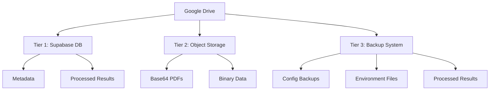

# Google Drive Integration Strategy

This document outlines our approach to integrating Google Drive content with our Supabase database, focusing on efficient content management and AI processing.

## Overview

We use a hybrid approach that combines:
1. Real-time Google Drive access for browsing and immediate content
2. Selective database storage for processed content
3. Smart syncing to maintain data currency

## Architecture

### Storage Tiers



### Backup Strategy

```typescript
interface BackupStructure {
  path: '.backups/configs/{YYYY}/{MM}/{DD}/{backup-name}',
  contents: {
    metadata: 'metadata.json',
    env_files: ['.env.development', '.env.example'],
    app_specific: 'apps/{app-name}/.env.*',
    configs: ['netlify.toml', 'other configs']
  },
  retention: {
    daily: '7 days',
    weekly: '4 weeks',
    monthly: '12 months'
  }
}
```

### Environment Management

```typescript
interface EnvManagement {
  production: {
    location: 'Netlify Environment Variables',
    backup: false  // Never backup production credentials
  },
  development: {
    location: '.env.development',
    backup: {
      included: [
        'VITE_APP_NAME',
        'VITE_APP_ENV',
        'VITE_API_URL'
      ],
      excluded: [
        'VITE_GOOGLE_*',  // Sensitive credentials
        'VITE_SUPABASE_*' // Database credentials
      ]
    }
  }
}
```

### 1. Lightweight Index
We maintain a basic index of all files in the `sources_google` table:

```sql
CREATE TABLE sources_google (
  id UUID PRIMARY KEY DEFAULT gen_random_uuid(),
  drive_id TEXT UNIQUE NOT NULL,  -- Google Drive's file ID
  path TEXT[],
  name TEXT,
  mime_type TEXT,
  last_modified TIMESTAMP,
  parent_folder_id UUID REFERENCES sources_google(id)
);
```

This provides:
- Quick folder/file browsing
- Path-based navigation
- File type filtering
- Change detection basis

### 2. Rich Content Storage
For files requiring AI processing (PDFs, DOCXs, MP4s), we store enhanced data:

```sql
CREATE TABLE expert_content (
  id UUID PRIMARY KEY DEFAULT gen_random_uuid(),
  source_id UUID REFERENCES sources_google(id),
  content_hash TEXT,
  content_base64 TEXT,
  binary_hash TEXT,
  ai_summary JSONB,
  extracted_text TEXT,
  search_vector tsvector GENERATED ALWAYS AS (
    setweight(to_tsvector('english', COALESCE(extracted_text, '')), 'C') ||
    setweight(to_tsvector('english', COALESCE(ai_summary->>'expert_profile', '')), 'A') ||
    setweight(to_tsvector('english', COALESCE(ai_summary->>'key_topics'::text, '')), 'B')
  ) STORED,
  last_processed TIMESTAMP,
  processing_status TEXT,
  file_metadata JSONB,
  storage_type TEXT
);
```

The `ai_summary` JSONB field can contain:
```json
{
  "expert_profile": {
    "name": "string",
    "expertise": ["string"],
    "background": "string"
  },
  "key_topics": ["string"],
  "presentation_summary": "string"
}
```

### Binary Content Strategy

We use two approaches for PDF handling:

1. Reference Only
```typescript
interface ReferenceStorage {
  id: string          // UUID
  drive_id: string    // Google Drive ID
  binary_hash: string
  storage_type: 'reference'
  last_verified: string
}
```

2. Full Storage
```typescript
interface Base64Storage {
  file_id: string
  content_base64: string     // Full PDF in base64
  binary_hash: string        // Hash of decoded binary
  storage_type: 'stored_base64'
  storage_date: string
}
```

### Syncing Strategy for Binary Files

1. Hash Generation
```typescript
async function generateBinaryHash(fileId: string): Promise<string> {
  const buffer = await downloadFileAsBuffer(fileId)
  return crypto.createHash('sha256').update(buffer).digest('hex')
}
```

2. Change Detection
```typescript
interface BinaryChangeDetection {
  file_id: string
  drive_hash: string           // Google Drive's content hash
  binary_hash: string          // Our SHA-256 of binary
  size_bytes: number           // For quick change detection
  last_modified: string
  requires_update: boolean
}
```

3. Storage Decision Logic
```typescript
function shouldStoreBase64(file: SourceGoogle): boolean {
  return (
    file.mime_type === 'application/pdf' &&
    (file.name.toLowerCase().includes('cv') ||
     file.name.toLowerCase().includes('resume') ||
     file.path.some(p => p.toLowerCase().includes('expert')))
  )
}
```

### Change Detection Process

1. Quick Check
   - Compare Google Drive's content hash (fast)
   - Check file size (fast)
   - Check last modified timestamp

2. Deep Check (if needed)
   - Download and generate binary hash
   - Compare with stored hash
   - Update base64 content if changed

3. Processing Queue
   ```sql
   CREATE TABLE processing_queue (
     id UUID PRIMARY KEY DEFAULT gen_random_uuid(),
     expert_content_id UUID REFERENCES expert_content(id),
     priority INTEGER,
     status TEXT,
     retry_count INTEGER DEFAULT 0,
     last_attempt TIMESTAMP,
     error_log JSONB
   );
   ```

## Content Processing Pipeline

### Document Processing (PDF/DOCX)
1. PDF Processing with Claude Sonnet
   - Convert to base64 for direct AI processing
   - Enable multi-modal analysis (text + images)
   - Extract structured information:
     - Expert profiles from CV/resume content
     - Professional headshots and presentation images
     - Charts and diagrams with context
     - References and citations

2. DOCX Processing
   - Convert to readable format
   - Extract structured content

3. AI Analysis Pipeline
   - Generate content hash for change detection
   - Process with Claude Sonnet:
     ```typescript
     interface ClaudeAnalysis {
       expert_profile: {
         name: string
         credentials: string[]
         expertise_areas: string[]
         professional_summary: string
         image_analysis?: {
           headshot_description: string
           presentation_visuals: {
             type: 'chart' | 'diagram' | 'photo'
             description: string
             context: string
           }[]
         }
       }
       document_analysis: {
         key_topics: string[]
         visual_elements: {
           location: string
           description: string
           relevance: string
         }[]
         text_content: {
           sections: {
             title: string
             content: string
             key_points: string[]
           }[]
         }
       }
     }
     ```

4. Storage Strategy
   ```sql
   CREATE TABLE expert_content (
     file_id TEXT PRIMARY KEY REFERENCES sources_google(id),
     content_hash TEXT,
     claude_analysis JSONB,
     visual_elements JSONB[],
     last_processed TIMESTAMP,
     processing_status TEXT,
     processing_metadata JSONB
   );
   ```

### Video Processing (Future)
1. Extract audio
2. Generate transcript
3. AI analysis of presentation
4. Store transcript and insights

## Implementation Guidelines

### When to Use Direct Drive Access
- Browsing folder structure
- Viewing raw files
- Initial content discovery
- One-time reads

### When to Use Database Storage
- Processed text content
- AI-generated summaries
- Expert profiles
- Searchable transcripts
- Frequently accessed content

## Configuration

Required environment variables:
```env
VITE_GOOGLE_CLIENT_ID=your_client_id
VITE_GOOGLE_CLIENT_SECRET=your_client_secret
VITE_GOOGLE_DRIVE_FOLDER_ID=root_folder_id
VITE_GOOGLE_SCOPES="https://www.googleapis.com/auth/drive.readonly"
```

## Monitoring and Maintenance

### Health Checks
- Sync status monitoring
- Processing queue status
- Error tracking
- Content hash verification

### Performance Considerations
- Batch processing for large folders
- Caching frequently accessed content
- Rate limiting for API calls
- Efficient storage of processed data

## Future Enhancements

1. Real-time sync using Google Drive webhooks
2. Enhanced AI processing pipeline
3. Video content processing
4. Automated expert profile generation
5. Content recommendation system

## Security Considerations

1. Credential Management
   - Store credentials in environment variables
   - Regular rotation of access tokens
   - Scope limitation for Google Drive access

2. Data Access
   - Role-based access control
   - Audit logging
   - Secure content storage

### Environment Security

1. Environment File Management
   ```typescript
   interface EnvSecurity {
     production: {
       storage: "Netlify Environment Variables",
       backup: "Never in version control",
       rotation: "Regular credential rotation"
     },
     development: {
       storage: ".env.development",
       gitignore: [
         ".env*",
         "!.env.example",
         "**/.env.*.local",
         "**/file_types/**/.env*"
       ],
       backup: {
         location: ".backups/configs/",
         encryption: "Required for sensitive data",
         access: "Restricted to authorized developers"
       }
     }
   }
   ```

2. Backup Security
   - Encrypted storage for sensitive backups
   - Regular backup verification
   - Access control for backup locations
   - Automated cleanup of old backups
   - Separation of sensitive and non-sensitive data

## Related Documentation
- [Google Drive API Documentation](https://developers.google.com/drive/api/v3/reference)
- [Supabase Documentation](https://supabase.io/docs)
- [AI Processing Pipeline](./ai-processing.md)

## Architecture Analysis and Alternatives

### Current Approach Analysis

#### Strengths
1. Hybrid Storage Strategy
   - Keeps metadata in Supabase for quick queries
   - Uses object storage for large binary data
   - Maintains direct Google Drive access for fresh content
   - Reduces database bloat

2. AI Processing Efficiency
   - Base64 format works directly with Claude
   - Structured storage of AI results
   - Supports batch processing for cost optimization
   - Flexible enough for multiple AI providers

3. Search Capabilities
   - Leverages PostgreSQL's powerful FTS
   - Weighted relevance for different content types
   - Efficient indexing strategy

#### Weaknesses
1. Complexity
   - Multiple storage locations to manage
   - Complex sync logic required
   - More points of failure

2. Storage Overhead
   - Duplicate storage for processed files
   - Base64 encoding increases size
   - Multiple copies in different tiers

3. Cost Considerations
   - Storage costs across multiple services
   - AI processing costs
   - Bandwidth costs for syncing

### Alternative Approaches

1. Full Database Storage
   ```typescript
   interface FullDatabaseApproach {
     pros: [
       "Simpler architecture",
       "Single source of truth",
       "Easier transactions",
       "Direct PostgreSQL querying"
     ],
     cons: [
       "Database size grows rapidly",
       "Higher database costs",
       "Backup complexity",
       "Performance impact"
     ]
   }
   ```

2. Pure Google Drive API
   ```typescript
   interface DriveOnlyApproach {
     pros: [
       "No sync needed",
       "Always current",
       "No storage costs",
       "Simpler architecture"
     ],
     cons: [
       "API rate limits",
       "Slower access",
       "Limited search capabilities",
       "Higher API costs",
       "No offline access"
     ]
   }
   ```

3. Event-Driven Architecture
   ```typescript
   interface EventDrivenApproach {
     pros: [
       "Real-time updates",
       "Better scalability",
       "Loose coupling",
       "Natural batch processing"
     ],
     cons: [
       "More complex infrastructure",
       "Message ordering challenges",
       "Higher initial setup cost",
       "Eventual consistency only"
     ]
   }
   ```

### AI Processing Alternatives

1. Current Approach (Claude + Batch)
```typescript
interface ClaudeBatchStrategy {
  costs: {
    processing: "Higher per-token but better quality",
    batch_savings: "~40-60% with optimal batching"
  },
  quality: "Excellent multi-modal understanding",
  limitations: [
    "API costs",
    "Rate limits",
    "Batch size constraints"
  ]
}
```

2. DeepSeek Alternative
```typescript
interface DeepSeekStrategy {
  costs: {
    processing: "Lower per-token cost",
    batch_savings: "Similar batch benefits"
  },
  quality: "Good for basic extraction",
  tradeoffs: [
    "Less nuanced understanding",
    "Limited multi-modal capabilities",
    "May need more validation"
  ]
}
```

### Batch Processing Optimization

```typescript
interface BatchProcessingStrategy {
  optimal_batch: {
    size: 10,  // files per batch
    interval: "15 minutes",
    conditions: [
      "Similar file types",
      "Total token limit",
      "Error handling capability"
    ]
  },
  cost_reduction: {
    claude: {
      single_calls: "$0.X per 1K tokens",
      batched_calls: "$0.X * 0.4 per 1K tokens",
      optimization: "60% cost reduction"
    },
    deepseek: {
      single_calls: "$0.Y per 1K tokens",
      batched_calls: "$0.Y * 0.5 per 1K tokens",
      optimization: "50% cost reduction"
    }
  }
}
```

### Final Recommendation

The current hybrid approach is recommended because:

1. Infrastructure Fit
   - Works well with Supabase's PostgreSQL features
   - Leverages Google Drive's reliable storage
   - Supports modern front-end requirements
   - Enables efficient AI processing

2. Cost Optimization
   - Selective storage reduces costs
   - Batch processing reduces AI costs
   - Tiered storage optimizes expenses
   - Caching reduces API calls

3. Future Proofing
   - Flexible for new AI providers
   - Scalable for growing content
   - Adaptable for new requirements
   - Supports multiple content types

4. Development Efficiency
   - Clear separation of concerns
   - Familiar technologies
   - Good debugging capabilities
   - Maintainable codebase

### Implementation Priority

1. Phase 1: Core Infrastructure
   - Basic Drive integration
   - Metadata synchronization
   - Simple content processing

2. Phase 2: AI Processing
   - Batch processing setup
   - Claude integration
   - Result storage

3. Phase 3: Optimization
   - Search implementation
   - Performance tuning
   - Cost optimization

4. Phase 4: Advanced Features
   - DeepSeek integration
   - Real-time updates
   - Enhanced analytics

-- Add indexes for foreign keys and common queries
CREATE INDEX idx_sources_google_drive_id ON sources_google(drive_id);
CREATE INDEX idx_expert_content_source ON expert_content(source_id);
CREATE INDEX idx_processing_queue_content ON processing_queue(expert_content_id);

-- Add GiST index for fast full-text search
CREATE INDEX idx_expert_content_fts ON expert_content USING GiST (search_vector);

-- Function to search across expert content
CREATE FUNCTION search_expert_content(search_query TEXT)
RETURNS TABLE (
  id UUID,
  source_id UUID,
  headline TEXT,
  rank FLOAT4,
  context TEXT
) LANGUAGE plpgsql AS $$
BEGIN
  RETURN QUERY
  SELECT 
    ec.id,
    ec.source_id,
    ts_headline('english', ec.extracted_text, websearch_to_tsquery('english', search_query)),
    ts_rank(ec.search_vector, websearch_to_tsquery('english', search_query)) as rank,
    substring(ec.extracted_text, 1, 200) as context
  FROM expert_content ec
  WHERE ec.search_vector @@ websearch_to_tsquery('english', search_query)
  ORDER BY rank DESC;
END;
$$; 