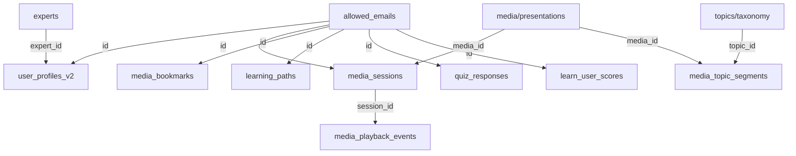

# Unified Learning Platform Architecture

## Overview

This document outlines the complete database architecture for the DHG learning platform, using `allowed_emails.id` as the universal user identifier across all systems.

## Core Principles

1. **Single User Identity**: `allowed_emails.id` is the primary key for all user-related data
2. **Clean Separation**: Each table has a single responsibility
3. **Learning-Focused**: Architecture supports personalized learning paths
4. **Progress Tracking**: Comprehensive tracking of user engagement and learning

## Table Architecture

### 1. Identity & Authentication Layer

```sql
allowed_emails (Universal User Identity)
├── id UUID PRIMARY KEY              -- Universal User ID used everywhere
├── email TEXT UNIQUE NOT NULL       -- Primary authentication email
├── name TEXT                        -- Display name
├── organization TEXT                -- Current organization
├── auth_user_id UUID                -- References auth.users.id when exists
├── auth_status TEXT                 -- 'none', 'invited', 'active'
├── is_active BOOLEAN DEFAULT true   -- Account enabled/disabled
├── metadata JSONB                   -- Additional tracking data
├── created_at TIMESTAMPTZ           -- When user was added
└── updated_at TIMESTAMPTZ           -- Last modification
```

### 2. User Profile & Learning Preferences

```sql
user_profiles_v2
├── id UUID PRIMARY KEY REFERENCES allowed_emails(id)
│
├── Professional Background
│   ├── profession TEXT                     -- Current profession/role
│   ├── professional_title TEXT             -- Formal title
│   ├── years_experience INTEGER            -- Years in field
│   ├── industry_sectors TEXT[]             -- Healthcare, Research, Education, etc.
│   ├── specialty_areas TEXT[]              -- Specific areas of expertise
│   └── credentials TEXT[]                  -- Degrees, certifications
│
├── Learning Preferences
│   ├── learning_goals TEXT[]               -- What they want to achieve
│   ├── reason_for_learning TEXT            -- Primary motivation
│   ├── preferred_formats TEXT[]            -- video, audio, text, interactive
│   ├── learning_pace TEXT                  -- self-paced, structured, intensive
│   ├── time_commitment TEXT                -- hours per week available
│   ├── preferred_depth TEXT                -- beginner, intermediate, advanced
│   └── preferred_session_length INTEGER    -- Minutes per session
│
├── Content Interests
│   ├── interested_topics TEXT[]            -- Specific topics from our taxonomy
│   ├── interested_experts UUID[]           -- References experts.id
│   ├── avoided_topics TEXT[]               -- Topics to exclude
│   ├── priority_subjects TEXT[]            -- Top 3-5 focus areas
│   └── content_tags_following TEXT[]       -- Tags they want to follow
│
├── Bio & Context
│   ├── bio_summary TEXT                    -- Personal statement
│   ├── learning_background TEXT            -- Previous relevant education
│   ├── current_challenges TEXT              -- What problems they're solving
│   ├── intended_application TEXT            -- How they'll use knowledge
│   └── referral_source TEXT                -- How they found us
│
├── System Fields
│   ├── onboarding_completed BOOLEAN DEFAULT false
│   ├── profile_completeness INTEGER        -- 0-100 percentage
│   ├── last_activity TIMESTAMPTZ
│   ├── created_at TIMESTAMPTZ
│   └── updated_at TIMESTAMPTZ
```

### 3. Learning Activity Tracking

```sql
media_sessions
├── id UUID PRIMARY KEY
├── user_id UUID REFERENCES allowed_emails(id)  -- Who is watching
├── media_id UUID                               -- Which media (presentation)
├── session_start TIMESTAMPTZ
├── session_end TIMESTAMPTZ
├── total_duration_seconds INTEGER
├── completion_percentage FLOAT
├── device_type TEXT
├── session_type TEXT                           -- 'learning', 'review', 'reference'
└── created_at TIMESTAMPTZ

media_playback_events
├── id UUID PRIMARY KEY
├── session_id UUID REFERENCES media_sessions(id)
├── user_id UUID REFERENCES allowed_emails(id)  -- For quick queries
├── event_type TEXT                             -- play, pause, seek, speed_change
├── timestamp_seconds FLOAT                     -- Position in media
├── event_data JSONB                           -- Additional event details
└── created_at TIMESTAMPTZ

media_topic_segments
├── id UUID PRIMARY KEY
├── media_id UUID                               -- Which presentation
├── topic_id UUID                               -- References topics/taxonomy
├── segment_title TEXT
├── start_time_seconds FLOAT
├── end_time_seconds FLOAT
├── ai_summary TEXT                             -- What's covered in this segment
├── key_concepts TEXT[]
├── difficulty_level TEXT
└── created_at TIMESTAMPTZ

media_bookmarks
├── id UUID PRIMARY KEY
├── user_id UUID REFERENCES allowed_emails(id)
├── media_id UUID
├── timestamp_seconds FLOAT
├── note TEXT                                   -- User's note
├── bookmark_type TEXT                          -- 'important', 'question', 'review'
├── tags TEXT[]                                 -- User-defined tags
└── created_at TIMESTAMPTZ
```

### 4. Learning Progress & Assessment (Future)

```sql
learning_paths (Future)
├── id UUID PRIMARY KEY
├── user_id UUID REFERENCES allowed_emails(id)
├── path_name TEXT
├── target_topics TEXT[]
├── target_completion_date DATE
├── status TEXT                                 -- active, paused, completed
├── created_at TIMESTAMPTZ
└── updated_at TIMESTAMPTZ

learning_milestones (Future)
├── id UUID PRIMARY KEY
├── user_id UUID REFERENCES allowed_emails(id)
├── milestone_type TEXT                         -- topic_completed, hours_watched, etc.
├── milestone_data JSONB
├── achieved_at TIMESTAMPTZ
└── acknowledged BOOLEAN DEFAULT false

quiz_responses (Future)
├── id UUID PRIMARY KEY
├── user_id UUID REFERENCES allowed_emails(id)
├── quiz_id UUID
├── media_id UUID                              -- Related presentation
├── responses JSONB
├── score FLOAT
├── time_taken_seconds INTEGER
├── submitted_at TIMESTAMPTZ
└── feedback_viewed BOOLEAN DEFAULT false
```

### 5. Personalization & Recommendations

```sql
learn_user_scores
├── id UUID PRIMARY KEY
├── user_id UUID REFERENCES allowed_emails(id)
├── media_id UUID
├── relevance_score FLOAT                      -- How relevant to user's interests
├── difficulty_match FLOAT                     -- How well matches user's level
├── engagement_score FLOAT                     -- Predicted engagement
├── reason TEXT                                -- Why recommended
├── calculated_at TIMESTAMPTZ
└── shown_to_user BOOLEAN DEFAULT false

learn_user_analytics
├── user_id UUID PRIMARY KEY REFERENCES allowed_emails(id)
├── total_minutes_watched INTEGER
├── average_session_length INTEGER
├── topics_explored TEXT[]
├── experts_followed TEXT[]
├── preferred_time_of_day TEXT
├── completion_rate FLOAT
├── quiz_average_score FLOAT
├── last_calculated TIMESTAMPTZ
└── insights JSONB                             -- AI-generated insights
```

## Key Relationships



## Implementation Guidelines

### 1. User Onboarding Flow

```sql
-- Step 1: User added to allowed_emails (done by admin or signup)
INSERT INTO allowed_emails (email, name, organization) 
VALUES ('user@example.com', 'John Doe', 'University');

-- Step 2: Create initial profile with onboarding questions
INSERT INTO user_profiles_v2 (
    id,
    profession,
    learning_goals,
    interested_topics,
    reason_for_learning
) VALUES (
    (SELECT id FROM allowed_emails WHERE email = 'user@example.com'),
    'Clinical Researcher',
    ARRAY['Understand stress biology', 'Apply to patient care'],
    ARRAY['stress', 'cortisol', 'HPA-axis'],
    'Developing new treatment protocols'
);

-- Step 3: System calculates initial content recommendations
INSERT INTO learn_user_scores (user_id, media_id, relevance_score, reason)
SELECT 
    user_id,
    media_id,
    calculate_relevance(user_id, media_id),
    'Matches your interest in stress biology'
FROM user_profiles_v2, available_media
WHERE /* matching logic */;
```

### 2. Learning Session Tracking

```sql
-- When user starts watching
INSERT INTO media_sessions (user_id, media_id, session_start) 
VALUES (@user_id, @media_id, NOW())
RETURNING id AS session_id;

-- Track events during playback
INSERT INTO media_playback_events (session_id, user_id, event_type, timestamp_seconds)
VALUES (@session_id, @user_id, 'play', 0.0);

-- User creates bookmark
INSERT INTO media_bookmarks (user_id, media_id, timestamp_seconds, note)
VALUES (@user_id, @media_id, 145.5, 'Important point about cortisol');
```

### 3. Progress Analytics

```sql
-- View: User's learning progress
CREATE VIEW user_learning_progress AS
SELECT 
    up.id as user_id,
    ae.name,
    up.learning_goals,
    COUNT(DISTINCT ms.media_id) as videos_watched,
    SUM(ms.total_duration_seconds) / 60 as total_minutes,
    AVG(ms.completion_percentage) as avg_completion,
    COUNT(DISTINCT mb.id) as bookmarks_created,
    up.interested_topics,
    ARRAY_AGG(DISTINCT mts.topic_id) as topics_covered
FROM allowed_emails ae
JOIN user_profiles_v2 up ON ae.id = up.id
LEFT JOIN media_sessions ms ON up.id = ms.user_id
LEFT JOIN media_bookmarks mb ON up.id = mb.user_id
LEFT JOIN media_topic_segments mts ON ms.media_id = mts.media_id
GROUP BY up.id, ae.name, up.learning_goals, up.interested_topics;
```

## Migration Steps

1. **Drop access_requests table** (no data migration needed)
2. **Create user_profiles_v2** with comprehensive fields
3. **Update media tracking tables** to use allowed_emails.id
4. **Create indexes** for performance
5. **Set up initial views** for analytics

## Security Considerations

- All tables should have RLS policies based on allowed_emails.id
- Use auth.uid() → allowed_emails.auth_user_id → allowed_emails.id for authenticated users
- Light auth users can only access their own data
- Admin users can access aggregated analytics

## Future Enhancements

1. **AI-Powered Recommendations**: Use viewing patterns to suggest content
2. **Social Learning**: Connect users with similar interests
3. **Adaptive Quizzing**: Adjust difficulty based on performance
4. **Learning Streaks**: Gamification elements
5. **Expert Q&A**: Connect learners with experts based on interests

## Success Metrics

- User engagement (session frequency, duration)
- Content completion rates
- Knowledge retention (quiz scores)
- Learning goal achievement
- User satisfaction scores

---

This architecture provides a solid foundation for personalized learning while maintaining clean data relationships and allowing for future growth.